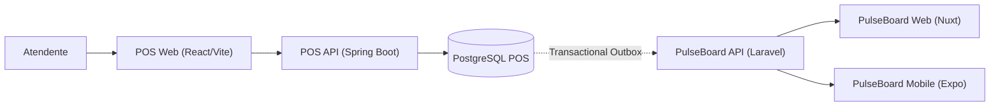

# PulseBoard POS

Ponto de venda (POS) que faz parte do ecossistema [PulseBoard](https://app.henriqueverri.dev). É um **sistema externo** ao PulseBoard: tem outro domínio, outro banco e outro ciclo de deploy, e só vai conhecer o PulseBoard pelo contrato público de ingestão (`POST /api/v1/ingest/*` com API Key). Nenhum código ou banco é compartilhado entre os dois repositórios.

> **Status: F12 — Resiliência da integração e tela de Integração.** O backend tem produtos, clientes e pedidos com ciclo de vida completo, API REST documentada no Swagger, erros em ProblemDetail, autenticação JWT com papéis ADMIN/CASHIER e testes com PostgreSQL real. O frontend React opera o caixa (venda completa), pedidos, clientes, produtos e a integração, respeitando os papéis. Pagamentos e estornos gravam um evento numa *transactional outbox* na mesma transação, e um worker os entrega à API de ingestão do PulseBoard, com classificação de erros, retry com backoff, ordem por pedido, pausa por API Key inválida e reprocessamento manual.

## Ecossistema (arquitetura alvo)



Fluxo planejado: a venda acontece no POS; o pedido pago grava um evento numa *transactional outbox* na mesma transação; um worker entrega a venda à API de ingestão do PulseBoard, que a transforma em analytics para o Web e o Mobile.

**O que existe hoje (F12):** `POS Web` + `POS API` + `PostgreSQL POS` + a outbox entregando ao `PulseBoard API`. Ver [Integração com o PulseBoard](#integração-com-o-pulseboard).

## Stack

- Java 21, Spring Boot 3.5 (Web, Validation, Data JPA, Actuator, Security, OAuth2 Resource Server)
- PostgreSQL 16 e Flyway
- springdoc-openapi (Swagger UI)
- Maven (wrapper incluído)
- JUnit 5 e Testcontainers (PostgreSQL real nos testes, nunca H2)
- Spotless (google-java-format)
- Frontend: React 19, Vite, TypeScript, Tailwind CSS, React Router, TanStack Query, React Hook Form, Zod
- Testes do frontend: Vitest, Testing Library e MSW
- Docker Compose (apenas o PostgreSQL); Dockerfile + Nginx para o frontend
- GitHub Actions

A API é um *resource server* JWT stateless (Spring Security + Nimbus, HS256), sem biblioteca JWT de terceiros. Detalhes na seção [Autenticação](#autenticação).

## Estrutura

```text
pulseboard-pos/
├── backend/                         API Spring Boot
│   ├── pom.xml, mvnw, mvnw.cmd, .mvn/
│   └── src/
│       ├── main/java/dev/henriqueverri/pos/   (package by feature)
│       │   ├── PosApplication.java
│       │   ├── shared/      ProblemDetail + códigos, Money (string JSON), PageResponse, Clock, OpenAPI
│       │   ├── catalog/     Product: entidade, repositório, serviço, controller, dto/
│       │   ├── customer/    Customer: idem
│       │   ├── order/       Order, OrderItem, OrderStatus, PaymentMethod: idem
│       │   ├── security/    SecurityConfig, TokenService, AuthController, User, Role, UserSeeder
│       │   └── integration/ outbox/ (OutboxEvent, OutboxService, OutboxStore, OutboxWorker) e
│       │                    pulseboard/ (PulseBoardClient, IngestPayloadFactory, PulseBoardProperties)
│       ├── main/resources/
│       │   ├── application.yml
│       │   └── db/migration/V1__baseline.sql … V7__outbox_retry.sql
│       └── test/java/dev/henriqueverri/pos/   espelha os pacotes + support/
├── frontend/                        POS Web (React + Vite)
│   ├── src/
│   │   ├── main.tsx
│   │   ├── app/         router, providers, AppLayout, RequireAuth (com papel), queryClient
│   │   ├── api/         client.ts (único cliente HTTP: JWT, ProblemDetail → ApiError), endpoints, tipos
│   │   ├── features/    auth, checkout (cartReducer), orders, products, customers
│   │   ├── components/ui/  Button, Field, Table, Badge, Dialog, Alert (Tailwind puro)
│   │   ├── lib/         money (string ↔ centavos), dates, labels, erros de formulário
│   │   └── test/        setup, handlers MSW, banco em memória, renderApp
│   ├── nginx/default.conf.template
│   └── Dockerfile
├── docker-compose.yml               PostgreSQL do POS (porta 5433)
├── .env.example
└── .github/workflows/ci.yml
```

## Pré-requisitos

- JDK 21
- Node.js 22 LTS (≥ 22.12) e npm, para o frontend
- Docker (para o PostgreSQL local e para os testes com Testcontainers)

O Maven não precisa estar instalado: use o `./mvnw` dentro de `backend/`.

## Como rodar

### 1. PostgreSQL

```bash
cp .env.example .env   # opcional: os defaults já funcionam
docker compose up -d
```

O PostgreSQL do POS escuta em **`localhost:5433`** (e não em 5432) para não colidir com o PostgreSQL do PulseBoard. Os dados ficam no volume `pos-db-data`.

### 2. API

```bash
cp .env.example .env              # se ainda não fez no passo 1
set -a; source .env; set +a       # a API lê as variáveis do ambiente (POS_JWT_SECRET é obrigatória)
cd backend
./mvnw spring-boot:run
```

A API sobe em `http://localhost:8080` e o Flyway aplica as migrations na inicialização. Sem `POS_JWT_SECRET` com pelo menos 32 bytes a aplicação **não sobe** (falha explícita no startup).

### 3. Health check

```bash
curl http://localhost:8080/actuator/health
# {"status":"UP"}
```

`/actuator/health` inclui a conexão com o banco: com o PostgreSQL fora do ar a resposta é `503` com `{"status":"DOWN"}`. É o único endpoint do Actuator exposto.

### 4. Swagger

- Swagger UI: `http://localhost:8080/swagger-ui/index.html`
- OpenAPI JSON: `http://localhost:8080/v3/api-docs`

Primeiro faça login em `POST /api/auth/login` (ex.: `caixa@pos.example` / `caixa-dev-password` do `.env.example`), copie o `access_token`, clique em **Authorize** e cole o token (o Swagger adiciona `Bearer`). Roteiro: criar cliente (`POST /api/customers`) → buscar produtos (`GET /api/products?q=PB-001`) → criar pedido (`POST /api/orders`) → pagar (`POST /api/orders/{id}/pay`) → estornar (`POST /api/orders/{id}/refund`). Um segundo pedido pode ser cancelado enquanto `PENDING`; qualquer transição fora da máquina de estados devolve `409`.

### 5. Frontend

```bash
cd frontend
npm ci
npm run dev
```

O Vite sobe em `http://localhost:5173` e encaminha `/api` para a API (mesma origem no navegador, sem CORS). O destino padrão é `http://localhost:8080`; para outra porta, use `VITE_API_PROXY_TARGET` (ver `frontend/.env.example`), por exemplo `VITE_API_PROXY_TARGET=http://localhost:8081 npm run dev`.

Entre com `caixa@pos.example` / `caixa-dev-password` (CASHIER) ou `admin@pos.example` / `admin-dev-password` (ADMIN), do `.env.example`.

#### Imagem Docker (Nginx)

```bash
docker build -t pulseboard-pos-web frontend
docker run --rm -p 8088:80 -e POS_API_UPSTREAM=http://host.docker.internal:8080 \
  --add-host=host.docker.internal:host-gateway pulseboard-pos-web
```

O Nginx serve o build estático (com fallback de SPA para `index.html`) e faz proxy de `/api/` para `POS_API_UPSTREAM` (padrão `http://api:8080`). O navegador fala só com o Nginx: mesma origem, sem CORS. O Compose do ecossistema completo fica para uma fase posterior.

## Frontend

| Tela | Rota | Papel |
|---|---|---|
| Login | `/login` | todos |
| Caixa | `/` | CASHIER, ADMIN |
| Pedidos (lista com filtros na URL, detalhe, pagar/cancelar/estornar) | `/orders`, `/orders/:id` | todos; estornar só ADMIN |
| Clientes (lista, busca, criação, edição) | `/customers` | CASHIER, ADMIN |
| Produtos (lista, criação, edição, ativar/desativar) | `/products` | ADMIN |
| Integração (saúde, eventos da outbox, detalhe, reprocessar) | `/integration` | ADMIN |

- **Caixa:** busca de produtos ativos por SKU ou nome, carrinho com quantidades, cliente (busca ou cadastro rápido), subtotal e total, forma de pagamento simulada (Dinheiro, Cartão, Pix) e tela de sucesso com o número do pedido. A venda chama `POST /api/orders` e em seguida `POST /api/orders/{id}/pay`; se o pagamento falhar, o pedido fica `PENDING` e a tela aponta para o detalhe dele.
- **Carrinho:** um `useReducer` (`cartReducer`) com preços e totais em **centavos inteiros**. O total exibido é só prévia: o servidor recalcula tudo. O checkout é validado com Zod antes de chamar a API.
- **Integração:** card de saúde (ligada/desligada/pausada, destino, prefixo da API Key, pendentes e falhas, último envio), banner quando a integração está pausada por API Key inválida, lista de eventos com filtro de status na URL e atualização a cada 5 s, painel lateral com payload, status HTTP, `code` e `X-Request-Id` enviado e recebido, e os botões "Reprocessar" (evento `FAILED`) e "Reprocessar falhas de configuração". O detalhe do pedido mostra o status de envio de cada evento do pedido (para todos os papéis; o link para a tela só para ADMIN) e se atualiza enquanto há envio em aberto.
- **Cliente HTTP único** (`src/api/client.ts`): adiciona `Authorization: Bearer <token>`, transforma qualquer erro em `ApiError` a partir do ProblemDetail (`code`, `detail`, `errors`). Nenhuma tela chama `fetch()` diretamente.
- **401** em qualquer chamada autenticada limpa a sessão e volta ao login com o aviso "Sua sessão expirou". **403** mostra "Acesso negado" com a mensagem da API. Erros de validação e de conflito (`duplicate_sku`, `duplicate_email`) aparecem no campo correspondente do formulário.
- **Papéis:** `RequireAuth` bloqueia rotas por papel (CASHIER que abre `/products` vê "Acesso negado") e o menu e as ações de ADMIN (Produtos, Estornar) não aparecem para o CASHIER. O backend continua sendo a fonte da regra.
- Estado de servidor no TanStack Query (retry só para falha de rede e 5xx, nunca 4xx).

### Onde fica o token (trade-off consciente)

O JWT fica em **`sessionStorage`** (ADR-007): sobrevive ao refresh da aba e some quando ela é fechada. `sessionStorage` é legível por qualquer script da página, então um XSS conseguiria roubar o token. A escolha é deliberada para este projeto (ferramenta interna de portfólio que demonstra Spring Security com JWT stateless, token de 8 h, sem dados sensíveis de pagamento) e **não é a opção mais segura em termos universais**. Em produção, o caminho seria cookie httpOnly ou um BFF, com CSP restritiva. O token nunca vai para `localStorage`.

## Autenticação

- `POST /api/auth/login` com `{ "email", "password" }` devolve `{ access_token, token_type: "Bearer", expires_in: 28800, user: { id, name, email, role } }`. Credencial errada (e-mail inexistente ou senha incorreta) devolve o mesmo `401 invalid_credentials`.
- `GET /api/auth/me` devolve o usuário do token.
- Token **HS256** de **8 h** (um turno), assinado com `POS_JWT_SECRET` (≥ 32 bytes, validado no startup). Claims: `sub` (id), `email`, `role`, `iat`, `exp`. Sem refresh token: expirou, novo login.
- API **stateless**: sem sessão HTTP e sem cookies; o cliente envia `Authorization: Bearer <token>`.
- Sem cadastro: os usuários `ADMIN` e `CASHIER` são criados (ou sincronizados, se a senha/nome mudar) no startup a partir de `POS_ADMIN_*` e `POS_CASHIER_*`, com senha em BCrypt. Uma variável sem e-mail ou senha apenas pula aquele usuário (com aviso no log).

Matriz de permissões (definida num único lugar, o `SecurityFilterChain`):

| Rota | Público | CASHIER | ADMIN |
|---|---|---|---|
| `POST /api/auth/login`, `/actuator/health`, `/swagger-ui`, `/v3/api-docs` | sim | sim | sim |
| `GET /api/auth/me`, `GET /api/products/**` | — | sim | sim |
| `/api/customers/**` (listar, criar, editar) | — | sim | sim |
| `POST /api/orders`, `GET /api/orders/**`, `pay`, `cancel` | — | sim | sim |
| `POST /api/products`, `PUT /api/products/{id}` | — | **não** | sim |
| `POST /api/orders/{id}/refund` | — | **não** | sim |

Sem token, token malformado, expirado ou com assinatura inválida → `401 unauthorized` (com `WWW-Authenticate: Bearer`); papel insuficiente → `403 forbidden`. Ambos em ProblemDetail, no mesmo formato dos demais erros.

## Domínio e API

| Recurso | Rotas |
|---|---|
| Produtos | `GET /api/products?q&active&page&size`, `GET /api/products/{id}`, `POST /api/products`, `PUT /api/products/{id}` (`active` ativa/desativa) |
| Clientes | `GET /api/customers?q&page&size`, `GET /api/customers/{id}`, `POST /api/customers`, `PUT /api/customers/{id}` |
| Pedidos | `GET /api/orders?status&from&to&number&page&size`, `GET /api/orders/{id}`, `POST /api/orders`, `POST /api/orders/{id}/pay`, `POST /api/orders/{id}/cancel`, `POST /api/orders/{id}/refund` |

Regras principais:

- **Máquina de estados:** `PENDING → PAID`, `PENDING → CANCELED`, `PAID → REFUNDED`. Todo o resto é `409 invalid_order_transition`. `paid_at`, `canceled_at` e `refunded_at` são gravados em segundos inteiros (UTC).
- **Locking otimista:** `Order` tem `@Version`; duas alterações concorrentes do mesmo pedido resultam em `409 concurrent_modification` para a segunda.
- **Totais no servidor:** o pedido recebe só `{ customerId, items: [{ productId, quantity }] }`. Preço unitário, SKU e nome vêm do catálogo e ficam como *snapshot* no item; `line_total = unit_price × quantity` e `total = Σ line_total`. Valores enviados pelo cliente são ignorados. Não há desconto nem frete, por isso só existe `total` (sem `subtotal`).
- **Dinheiro:** `NUMERIC(12,2)` no banco, `BigDecimal` com duas casas no Java e **string** no JSON (`"409.70"`), nos dois sentidos: número JSON em campo monetário é rejeitado. Não há arredondamento: entradas com mais de duas casas são rejeitadas e as contas (preço × quantidade inteira, soma) são exatas.
- **Produtos:** SKU obrigatório (até 64) e único. Produto inativo não pode ser vendido (`422 product_inactive`). Sem estoque.
- **Clientes:** e-mail obrigatório, único sem diferenciar maiúsculas (armazenado em minúsculas); `document` é opcional e interno ao POS.
- **Pedidos:** cliente obrigatório, de 1 a 100 itens, quantidade de 1 a 10.000, cada produto uma única vez (`422 duplicate_order_item`). Número legível sequencial (`number`) além do `id` UUID. Moeda única configurada em `POS_CURRENCY`.
- **Paginação:** `page` (desde 0) e `size` (1–100) com envelope `{ content, page, size, totalElements, totalPages }`.

### Catálogo de demonstração

`V4__seed_catalog.sql` cria os 40 SKUs da organização de demo do PulseBoard (`PB-001-ESS` a `PB-020-PRO`), com nomes e preços copiados do `DemoDataSeeder` do PulseBoard. Os SKUs precisam existir nos dois sistemas para a integração aceitar a venda.

### Erros

Todos os erros seguem ProblemDetail (RFC 9457), com `Content-Type: application/problem+json`, a propriedade estável `code` e, em validação, `errors` por campo:

```json
{
  "type": "about:blank",
  "title": "Bad Request",
  "status": 400,
  "detail": "Os dados enviados são inválidos.",
  "instance": "/api/customers",
  "code": "validation_failed",
  "errors": { "email": ["deve ser um endereço de e-mail bem formado"] }
}
```

| Status | `code` |
|---|---|
| 400 | `validation_failed`, `malformed_request` |
| 401 | `unauthorized`, `invalid_credentials` |
| 403 | `forbidden` |
| 404 | `not_found` |
| 409 | `invalid_order_transition`, `concurrent_modification`, `duplicate_sku`, `duplicate_email` |
| 422 | `unknown_customer`, `unknown_product`, `product_inactive`, `duplicate_order_item`, `order_total_too_large` |
| 500 | `internal_error` (sem detalhes internos nem stack trace) |

## Integração com o PulseBoard

O POS usa só o contrato público de ingestão do PulseBoard (`docs/integration.md` daquele repositório), autenticado por uma API Key da organização. Nada no PulseBoard foi feito para o POS.

**Transactional outbox.** `pay` e `refund` gravam, na **mesma transação** da mudança do pedido, uma linha em `outbox_events` com o corpo HTTP já pronto (*snapshot*). Se a gravação do evento falhar, o pagamento ou o estorno inteiro é desfeito: nunca existe pedido pago sem evento, nem evento de pedido não pago. Nenhuma chamada HTTP acontece dentro dessa transação.

| Mudança no POS | Evento | Chamada ao PulseBoard |
|---|---|---|
| `PENDING → PAID` | `ORDER_PAID` | `POST /ingest/transactions` com `external_id = pos:<uuid do pedido>`, `status: paid`, cliente (`pos:cus:<uuid>`, nome, e-mail), itens por SKU e `total_amount` |
| `PAID → REFUNDED` | `ORDER_REFUNDED` | `POST /ingest/transactions/pos:<uuid>/status-changes` com `status: refunded` |

Pedidos cancelados não existem para o PulseBoard (nunca foram vendas) e não geram evento. Valores vão como string com duas casas, datas em UTC com segundos inteiros; o `document` do cliente não sai do POS.

**Worker.** A cada `POS_OUTBOX_POLL_INTERVAL` (2 s) o worker reivindica um lote em sequência com `FOR UPDATE SKIP LOCKED`, marcando os eventos `PROCESSING` com um *lease* de 2 minutos, e confirma. São reivindicáveis os eventos `PENDING` com `next_attempt_at` vencido e os `PROCESSING` com lease expirado (worker que morreu). Depois envia cada evento **fora de transação** e grava o resultado numa transação curta, só se o evento ainda pertencer àquela tentativa (`status = PROCESSING` e o mesmo `attempts`). Vários workers podem rodar ao mesmo tempo sem enviar o mesmo evento duas vezes.

**Ordem por pedido.** Um evento só é reivindicado se nenhum evento anterior do mesmo pedido (menor `sequence`) estiver fora de `SENT`. O estorno nunca chega antes da venda; enquanto a venda falha, o estorno aparece como "bloqueado por #N". Pedidos diferentes não se bloqueiam.

**Classificação da resposta:**

| Resposta | Resultado |
|---|---|
| `200`/`201` (inclusive replay idempotente) | `SENT` |
| timeout, falha de rede, `5xx` | nova tentativa com backoff |
| `429` | nova tentativa respeitando `Retry-After` (segundos ou data HTTP; 60 s se ausente) |
| `401` | `FAILED` / `CONFIGURATION` (`invalid_api_key`) e **pausa** da integração |
| `409 invalid_transition` no estorno | reconciliação: `GET /transactions/{external_id}`; se já está `refunded` → `SENT`, senão `FAILED` / `PERMANENT` com o status remoto |
| `409 customer_email_conflict` | `FAILED` / `PERMANENT`, com a instrução de vincular o cliente pelo ID externo no PulseBoard e reprocessar |
| outros `4xx` (`422` de SKU desconhecido, `403`, `404`…) | `FAILED` / `PERMANENT`, com `code`, mensagem e erros de campo do PulseBoard |

**Retry.** Atraso da tentativa *n* = `min(15 min, 10 s · 2^(n−1))` multiplicado por um *jitter* aleatório entre 0,5 e 1,0, gravado em `next_attempt_at` (sobrevive a restart). Depois de `POS_OUTBOX_MAX_ATTEMPTS` (10) tentativas sem sucesso o evento vira `FAILED` / `EXHAUSTED`. Erros permanentes não são repetidos.

**Pausa por API Key inválida.** Um `401` marca o evento `FAILED` / `CONFIGURATION`, devolve à fila (sem gastar tentativa) o resto do lote e pausa o worker por 15 minutos (em memória: um restart retoma na hora). A tela de Integração mostra o banner. Depois da pausa só eventos `PENDING` são reivindicados; os de configuração ficam parados até alguém corrigir a chave e clicar **Reprocessar falhas de configuração**, que os devolve a `PENDING` e encerra a pausa.

**Reprocessamento manual.** `POST /api/integration/events/{id}/retry` (ADMIN) devolve um evento `FAILED` a `PENDING` para envio imediato. O contador `attempts` é **mantido** (histórico real de tentativas); o limite de 10 e o backoff passam a contar a partir do reprocessamento (`attempts_at_retry`). Reprocessar um evento que não está `FAILED` responde `409 integration_event_not_failed`.

**API de integração (ADMIN):** `GET /api/integration/events?status=&page=&size=`, `GET /api/integration/events/{id}` (com payload), `POST /api/integration/events/{id}/retry`, `POST /api/integration/events/retry-configuration-failures` e `GET /api/integration/health` → `{enabled, pausedUntil, targetUrl, keyPrefix, pending, failed, lastSentAt}` (só o prefixo público da chave, nunca o segredo). `GET /api/orders/{id}` inclui `integrationEvents` com o status de envio de cada evento do pedido.

**Idempotência.** Todo envio de um evento usa o mesmo corpo (lido da outbox) e o mesmo `X-Request-Id: pos-<id do evento>`. O PulseBoard deduplica por `external_id`: um reenvio depois de um resultado perdido recebe `200` com `Idempotent-Replayed: true` e é tratado como sucesso.

**Headers:** `Authorization: Bearer <API Key>`, `Content-Type: application/json`, `Accept: application/json`, `X-Request-Id`. Timeouts: 10 s de conexão, 30 s de resposta.

**Desligada ou sem chave.** Com `PULSEBOARD_INTEGRATION_ENABLED=false` ou sem `PULSEBOARD_API_KEY`, o POS sobe e vende normalmente; os eventos ficam `PENDING` e são entregues quando a integração for ligada. A chave nunca aparece em logs, respostas ou mensagens de erro.

### Testar com o PulseBoard local

1. Suba o PulseBoard (`apps/api`: `php artisan serve --port=8000`) com o banco de demonstração; a organização de demo já tem os 40 SKUs do POS.
2. Crie uma API Key em **Integração → API Keys** no PulseBoard.
3. Rode a API do POS com `PULSEBOARD_API_URL=http://localhost:8000/api/v1` e `PULSEBOARD_API_KEY=<a chave>` no ambiente (não no `.env.example`).
4. Faça uma venda no caixa. Em segundos a transação `pos:<uuid>` aparece no PulseBoard como `paid`; estorne o pedido e ela passa a `refunded`. Acompanhe em **Integração** (login ADMIN).
5. Para ver a resiliência: pare o PulseBoard e venda (o evento fica `PENDING` com a próxima tentativa agendada; ao subir o PulseBoard ele é entregue); use uma chave revogada (o evento falha por configuração e a integração pausa); venda um produto cujo SKU não existe no PulseBoard (`FAILED` / rejeitado, com o erro de `items.0.sku`).

## Configuração

A API lê as variáveis do ambiente; os defaults de `application.yml` apontam para o PostgreSQL do Compose. O Docker Compose lê o `.env` da raiz automaticamente.

| Variável | Padrão | Uso |
|---|---|---|
| `POS_DB_URL` | `jdbc:postgresql://localhost:5433/pulseboard_pos` | JDBC URL da API |
| `POS_DB_USER` | `pos` | usuário do banco (API e Compose) |
| `POS_DB_PASSWORD` | `pos` | senha do banco (API e Compose), só para desenvolvimento local |
| `POS_DB_NAME` | `pulseboard_pos` | nome do banco criado pelo Compose |
| `POS_DB_PORT` | `5433` | porta do PostgreSQL no host |
| `SERVER_PORT` | `8080` | porta HTTP da API |
| `POS_CURRENCY` | `BRL` | moeda dos pedidos |
| `POS_JWT_SECRET` | — (obrigatória, ≥ 32 bytes) | segredo HS256 dos tokens |
| `POS_ADMIN_EMAIL` / `POS_ADMIN_PASSWORD` / `POS_ADMIN_NAME` | — / — / `Administrador` | usuário ADMIN criado no startup |
| `POS_CASHIER_EMAIL` / `POS_CASHIER_PASSWORD` / `POS_CASHIER_NAME` | — / — / `Caixa` | usuário CASHIER criado no startup |
| `PULSEBOARD_INTEGRATION_ENABLED` | `true` | liga/desliga o envio ao PulseBoard |
| `PULSEBOARD_API_URL` | `http://localhost:8000/api/v1` | base da API de ingestão |
| `PULSEBOARD_API_KEY` | — (vazia: nada é enviado) | API Key `pb_<prefixo>_<segredo>` da organização |
| `POS_OUTBOX_POLL_INTERVAL` | `2s` | intervalo entre ciclos do worker |
| `POS_OUTBOX_MAX_ATTEMPTS` | `10` | tentativas antes de `FAILED` / `EXHAUSTED` |

Nunca coloque credenciais reais no `.env.example` ou no repositório.

## Testes

```bash
cd backend
./mvnw verify
```

Os testes de integração usam **Testcontainers**: sobem um `postgres:16-alpine` descartável (o Docker precisa estar rodando; o Compose não é necessário), aplicam o Flyway do zero e nunca usam H2. O que cada suíte protege:

| Suíte | Cobre |
|---|---|
| `OrderStatusTest`, `OrderTest` | matriz completa de transições, totais, snapshots, timestamps em segundos |
| `MoneyTest` | escala, ausência de arredondamento silencioso, string no JSON, número JSON rejeitado |
| `OrderApiTest` | fluxo criar → pagar → estornar, cancelar, 409 em transições inválidas, 404, 422, validação, paginação e filtros, totais do cliente ignorados |
| `ProductApiTest`, `CustomerApiTest` | CRUD, unicidade de SKU/e-mail (409), validação, busca e paginação |
| `OrderOptimisticLockingTest` | duas transações concorrentes no mesmo pedido: a segunda falha por `@Version` |
| `RepositoryIntegrationTest` | seed dos 40 SKUs, constraints e índices únicos, sequência do número do pedido |
| `OpenApiDocsTest` | OpenAPI com as rotas reais, dinheiro como `string` e esquema Bearer |
| `AuthApiTest` | login (válido, inválido, indistinguível), claims e validade do token, `/auth/me`, 401 sem token / malformado / expirado / assinatura inválida, rotas públicas |
| `AuthorizationMatrixTest` | matriz ADMIN/CASHIER (403) e 401 em todas as rotas da API |
| `SecurityPropertiesTest`, `UserSeederTest` | startup falha com segredo fraco; seed idempotente com BCrypt |
| `PosApplicationIntegrationTest` | PostgreSQL 16, migrations aplicadas, `/actuator/health` `UP` |
| `IngestPayloadFactoryTest` | JSON exato de `ORDER_PAID` e `ORDER_REFUNDED` (dinheiro em string, UTC em segundos, sem `document`) |
| `OutboxTransactionTest` | evento gravado na transação de `pay`/`refund`; falha real do banco ao gravar o evento desfaz o pagamento (pedido continua `PENDING`, nenhum evento órfão); cancelamento não gera evento |
| `OutboxDeliveryTest` | worker contra um PulseBoard simulado (**WireMock**): 201 → `SENT`, headers e corpo exatos, reenvio após resultado perdido vira replay idempotente, worker atrasado não sobrescreve o resultado, estorno por `status-changes`, 422 → `FAILED` / `PERMANENT`, timeout e falha de rede → nova tentativa agendada |
| `OutboxResilienceTest` | WireMock: esgotamento após 10 tentativas, `429` com e sem `Retry-After`, `401` → pausa → só `PENDING` após a pausa → reprocessar falhas de configuração, três casos de reconciliação do `409 invalid_transition`, reprocessamento manual (limite recomeça, `attempts` mantido) |
| `OutboxClaimTest` | PostgreSQL real: ordem por pedido e `blockedBy`, backoff respeitado, lease expirado reivindicável, `SKIP LOCKED` (segunda transação não vê o evento travado), dois workers concorrentes em 12 eventos sem envio duplicado |
| `IntegrationApiTest` | endpoints de integração: lista, filtro, detalhe com payload, retry (404/409), health sem segredo, eventos no detalhe do pedido |
| `IngestResponseClassifierTest`, `RetryPolicyTest`, `IntegrationPauseTest` | tabela de classificação completa, fórmula do backoff com jitter e teto, `Retry-After`, pausa de 15 min |
| `OutboxWorkerDisabledTest`, `PulseBoardPropertiesTest` | integração desligada, sem chave ou pausada não reivindica nem envia nada; prefixo público da chave; a chave nunca aparece no `toString` |

Para rodar só os testes: `./mvnw test`.

### Frontend

```bash
cd frontend
npm ci
npm run lint && npm run typecheck && npm test && npm run build
```

Os testes rodam no Vitest com jsdom; as telas usam as rotas e os providers reais e a API é simulada com **MSW** (um banco em memória com as mesmas regras de autenticação e papéis do backend).

| Suíte | Cobre |
|---|---|
| `cartReducer.test.ts` | adicionar, somar quantidade, limites de quantidade e de itens, remover, cliente, limpar, totais em centavos |
| `money.test.ts` | conversão string ↔ centavos sem ponto flutuante, formatação pt-BR |
| `schemas.test.ts` | schemas Zod de checkout, produto, cliente e login |
| `client.test.ts` | header Bearer, erro a partir do ProblemDetail, 401 limpa a sessão, 401 do login não, falha de rede |
| `CheckoutPage.test.tsx` | venda completa com MSW (corpo das requisições conferido), validação, erro 422 da API, pedido criado sem pagamento, cliente criado no caixa |
| `auth.test.tsx` | anônimo → login, token em `sessionStorage` (nunca `localStorage`), credencial inválida, 401 → login com aviso, logout |
| `authorization.test.tsx` | CASHIER sem menu/tela de Produtos e sem Estornar; ADMIN com acesso e estorno |
| `orders.test.tsx` | filtros na URL, pagar, cancelar, conflito 409, 403 → acesso negado |
| `ProductsPage.test.tsx` | criação com preço em string decimal, `duplicate_sku` no campo, erros de validação do servidor |
| `integration.test.tsx` | card de saúde, lista com "bloqueado por" e tipo de falha, reprocessar (sucesso e 409), painel com payload e request ids, banner de pausa e reprocessar falhas de configuração, integração desligada, filtro na URL, polling, CASHIER sem acesso, status de envio no detalhe do pedido |

## Formatação

```bash
cd backend
./mvnw spotless:check   # verifica (também roda no `verify` e na CI)
./mvnw spotless:apply   # formata
```

## Migrations

As migrations ficam em `backend/src/main/resources/db/migration`:

| Versão | Conteúdo |
|---|---|
| `V1__baseline.sql` | vazia (só comentários): inaugura o histórico do Flyway |
| `V2__catalog_customers.sql` | `products`, `customers` |
| `V3__orders.sql` | `orders` (com `version`), `order_items`, sequência `order_number_seq` |
| `V4__seed_catalog.sql` | catálogo de demonstração (40 SKUs) |
| `V5__users.sql` | `users` (e-mail único, hash BCrypt, papel `ADMIN`/`CASHIER`) |
| `V6__outbox_events.sql` | `outbox_events` (snapshot `jsonb`, `sequence`, status, tentativas, lease, último erro) |
| `V7__outbox_retry.sql` | `next_attempt_at`, `failure_kind`, `attempts_at_retry` e o índice de reivindicação; falhas provisórias da F11 voltam para `PENDING` |

## CI

`.github/workflows/ci.yml` roda dois jobs em todo push na `main` e em pull requests:

- `backend`: Java 21 (Temurin) com cache do Maven, e `./mvnw -B spotless:check verify`. Os testes com Testcontainers usam o Docker do runner do GitHub.
- `frontend`: Node 22 LTS com cache do npm, e `npm ci`, `npm run lint`, `npm run typecheck`, `npm test`, `npm run build`.
