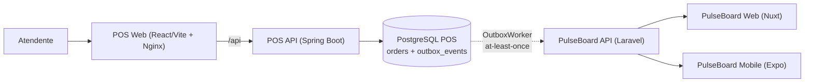

# PulseBoard POS

Ponto de venda (POS) web que entrega cada venda ao [PulseBoard](https://app.henriqueverri.dev), um SaaS de analytics de vendas, usando **Transactional Outbox** em PostgreSQL, entrega **at-least-once** com idempotência, retry com backoff e observabilidade ponta a ponta.

O POS é um **sistema externo** ao PulseBoard: outro domínio, outro banco, outro ciclo de deploy. Ele conhece o PulseBoard apenas pelo contrato público de ingestão (`POST /api/v1/ingest/*` com API Key), exatamente como uma loja ou um ERP de terceiros faria. Nenhum código ou banco é compartilhado, e nada no PulseBoard foi feito para o POS.


**Demo:** roteiro reproduzível com screenshots reais em [`docs/demo.md`](docs/demo.md) (login → venda → pagamento → evento na integração → entrega → falha e retry). *TODO: vídeo/GIF curto do fluxo.*

## Sumário

- [Stack](#stack) · [Arquitetura](#arquitetura) · [Fluxo de venda](#fluxo-de-venda) · [Integração e outbox](#integração-com-o-pulseboard)
- [Observabilidade](#observabilidade) · [Autenticação](#autenticação-e-autorização)
- [Executar com Docker Compose](#executar-com-docker-compose) · [Executar localmente](#executar-localmente) · [Testes](#testes)
- [Variáveis de ambiente](#variáveis-de-ambiente) · [Usuários demo](#usuários-demo) · [Configurar o PulseBoard](#configurar-a-integração-com-o-pulseboard)
- [Endpoints](#endpoints-principais) · [Decisões](#decisões-arquiteturais) · [Limitações](#limitações-e-fora-de-escopo) · [Estrutura](#estrutura-de-diretórios)

## Stack

| Camada | Tecnologias |
|---|---|
| API | Java 21, Spring Boot 3.5 (Web, Validation, Data JPA, Security, OAuth2 Resource Server, Actuator), springdoc-openapi |
| Banco | PostgreSQL 16, Flyway, `jdbc` puro (`JdbcClient`) nas queries da outbox |
| Web | React 19, Vite 7, TypeScript, Tailwind CSS 4, React Router 7, TanStack Query, React Hook Form, Zod |
| Testes | JUnit 5, Testcontainers (PostgreSQL real, nunca H2), WireMock; Vitest, Testing Library, MSW |
| Infra | Docker Compose (db, api, web), Nginx, GitHub Actions (backend, frontend, hadolint + build das imagens) |
| Qualidade | Spotless (google-java-format), ESLint, `tsc` |

## Arquitetura

Monólito modular: a API e o worker da outbox rodam no mesmo processo Spring Boot, organizado por feature (`catalog`, `customer`, `order`, `security`, `integration`, `shared`). Não há broker, Redis nem microsserviços: o PostgreSQL guarda os pedidos e a fila de eventos.

```text
┌──────────────────────┐
│   POS Web            │  React + Vite, servido pelo Nginx
│   (Nginx :8088)      │  /api/* → proxy para a API (mesma origem, sem CORS)
└──────────┬───────────┘
           │ HTTP + JWT (Bearer)            X-Request-Id
           ▼
┌──────────────────────┐
│   POS API            │  Spring Boot: REST + ProblemDetail + JWT HS256
│   (:8080)            │  RequestIdFilter → MDC request_id → logs JSON
└──────────┬───────────┘
           │ uma transação: UPDATE orders + INSERT outbox_events
           ▼
┌──────────────────────┐
│   PostgreSQL         │  orders, order_items, products, customers, users
│   Orders + Outbox    │  outbox_events (snapshot jsonb, status, attempts, lease)
└──────────┬───────────┘
           │ OutboxWorker (@Scheduled 2 s, mesmo processo da API)
           │ claim FOR UPDATE SKIP LOCKED + lease → HTTP fora de transação → record
           ▼
┌──────────────────────┐
│   PulseBoard API     │  POST /ingest/transactions
│   /api/v1/ingest/*   │  POST /ingest/transactions/{external_id}/status-changes
└──────────────────────┘  GET  /ingest/transactions/{external_id}  (reconciliação)
                          API Key · X-Request-Id: pos-<event id> · idempotente por external_id
```

No ecossistema completo, o PulseBoard transforma a venda em analytics para o PulseBoard Web (Nuxt) e o PulseBoard Mobile (Expo):



## Fluxo de venda

1. **Caixa** (CASHIER ou ADMIN): busca produtos ativos por SKU ou nome, monta o carrinho (centavos inteiros no front, só prévia), escolhe o cliente (busca ou cadastro rápido) e a forma de pagamento simulada (Dinheiro, Cartão, Pix).
2. `POST /api/orders` cria o pedido `PENDING`. O servidor ignora preços enviados pelo cliente: preço, SKU e nome vêm do catálogo e ficam como snapshot no item; `total = Σ preço × quantidade`.
3. `POST /api/orders/{id}/pay` muda para `PAID` e, **na mesma transação**, grava o evento `ORDER_PAID` na outbox. A resposta não espera o PulseBoard.
4. O worker entrega o evento em segundos. O detalhe do pedido e a tela de Integração mostram o status do envio.
5. **Estorno** (ADMIN): `PAID → REFUNDED` grava `ORDER_REFUNDED`, entregue como mudança de status da mesma transação no PulseBoard, sempre depois da venda.

Máquina de estados: `PENDING → PAID`, `PENDING → CANCELED`, `PAID → REFUNDED`; qualquer outra transição é `409 invalid_order_transition`. Pedidos cancelados nunca foram vendas e não geram evento. `Order` tem `@Version` (locking otimista: a segunda alteração concorrente recebe `409 concurrent_modification`).

**Dinheiro** é `NUMERIC(12,2)` no banco, `BigDecimal` com duas casas no Java e **string** no JSON (`"409.70"`), nos dois sentidos; número JSON em campo monetário é rejeitado. Sem ponto flutuante em nenhum ponto.

## Integração com o PulseBoard

Resumo abaixo. O documento completo, com payloads, estados, troubleshooting e exemplos reais de log, está em [`docs/integration.md`](docs/integration.md); a conferência contra o contrato do PulseBoard, em [`docs/contract-checklist.md`](docs/contract-checklist.md).

**Transactional Outbox.** `pay` e `refund` gravam a mudança do pedido e a linha em `outbox_events` (com o corpo HTTP pronto, como snapshot `jsonb`) na mesma transação. Se o pedido está pago, o evento existe; se a gravação do evento falha, o pagamento é desfeito. Nenhuma chamada HTTP acontece dentro da transação do pedido: o PulseBoard fora do ar nunca impede uma venda.

**Worker.** A cada 2 s, o `OutboxWorker`:

1. reivindica um lote numa transação curta com `FOR UPDATE SKIP LOCKED`, marcando os eventos `PROCESSING` com um **lease** de 2 min e `attempts + 1`;
2. envia cada evento **fora de transação**;
3. grava o resultado numa segunda transação, condicionada a `status = PROCESSING` e ao mesmo `attempts`. Esse **fencing** faz com que um worker atrasado, cujo lease expirou, não sobrescreva o resultado de quem re-reivindicou o evento.

Várias instâncias podem rodar ao mesmo tempo sem enviar o mesmo evento em paralelo. Se o processo morre no meio, o evento volta a ser elegível quando o lease expira.

**Ordenação por pedido.** Um evento só é reivindicado quando todos os eventos anteriores do mesmo pedido estão `SENT`: o estorno nunca chega antes da venda. Enquanto a venda falha, o estorno aparece como "bloqueado por #N".

**Classificação das respostas:**

| Resposta | Resultado |
|---|---|
| `201`, ou `200` com `Idempotent-Replayed: true` | `SENT` |
| timeout, falha de rede, `5xx` | `PENDING` com backoff |
| `429` | `PENDING` até `Retry-After` (60 s se ausente) |
| `401` | `FAILED` / `CONFIGURATION` e **pausa** da integração por 15 min |
| `409 invalid_transition` num estorno | **reconciliação** via `GET`: se já está `refunded` → `SENT` |
| `409` (outros), `422`, `404`, `413` e demais `4xx` | `FAILED` / `PERMANENT`, com `code` e erros por campo |

**Retry e backoff.** Atraso após a tentativa *n*: `min(15 min, 10 s × 2^(n−1))` × jitter aleatório em `[0,5; 1,0]` (10 s, 20 s, 40 s… até 15 min), persistido em `next_attempt_at`. Após 10 tentativas: `FAILED` / `EXHAUSTED`. Não há retry em processo (Resilience4j/`@Retryable`): a outbox é o único mecanismo de retry.

**Idempotência: at-least-once, não exactly-once.** Um evento pode ser enviado mais de uma vez (timeout com a venda já gravada, worker que caiu depois do envio). O PulseBoard deduplica pelo `external_id` (`pos:<uuid do pedido>`) e compara o conteúdo. Como todo reenvio usa o mesmo snapshot e o mesmo `X-Request-Id: pos-<id do evento>`, o reenvio recebe `200` replay e é tratado como sucesso. Nunca há uma segunda venda; um conteúdo divergente seria `409 transaction_conflict` (falha permanente).

**Reconciliação.** Um estorno que recebe `409 invalid_transition` (o primeiro envio foi gravado, mas a resposta se perdeu) consulta `GET /ingest/transactions/{external_id}`. Se a transação já está `refunded`, o evento vira `SENT`; caso contrário, falha permanente com o status remoto.

**401 sem loop.** Com a chave inválida, todos os eventos falhariam: o worker pausa a integração inteira por 15 min (no máximo uma requisição por pausa). Depois de corrigir a chave e reiniciar, **Reprocessar falhas de configuração** devolve esses eventos à fila.

**Reprocessamento manual** (ADMIN): `POST /api/integration/events/{id}/retry` devolve um evento `FAILED` a `PENDING`; `attempts` é mantido como histórico e o limite recomeça a contar.

**Desligada ou sem chave.** O POS vende normalmente e os eventos ficam `PENDING` até a integração ser ligada.

## Observabilidade

Detalhes e exemplos reais em [`docs/integration.md#observabilidade`](docs/integration.md#observabilidade).

- **Logs JSON** no formato estruturado nativo do Spring Boot (layout Logstash; `POS_LOG_FORMAT=` vazio volta ao texto simples). Cada tentativa de entrega gera linhas com campos fixos (`event_id`, `order_id`, `external_id`, `event_type`, `attempt`, `outcome`, `http_status`, `error_code`, `failure_kind`, `duration_ms`, `request_id`), que permitem reconstruir claim → requisição HTTP → resposta → classificação → persistência. Polling sem trabalho não gera log.
- **Request ID.** `RequestIdFilter` reutiliza o `X-Request-Id` recebido (se válido) ou gera um, coloca-o no MDC (`request_id`), devolve-o na resposta e limpa o MDC ao final. No worker, o `request_id` é `pos-<id do evento>`, o mesmo `X-Request-Id` enviado ao PulseBoard, que o registra no próprio log (`event: ingest.transaction`). A linha `Outbox event enqueued` liga o `request_id` da requisição de pagamento ao `event_id`.
- **Health.** `/actuator/health` tem o componente `pulseBoard` (`DISABLED`, `NOT_CONFIGURED`, `INVALID_KEY`, `PAUSED`, `ACTIVE`, além de backlog e prefixo da chave), calculado só com estado local, sem chamar o PulseBoard. Anônimos veem apenas `{"status":"UP"}`; um token ADMIN vê os componentes.
- **Nunca registrados:** API Key, header `Authorization`, JWT, senhas, payloads e dados pessoais do cliente. Há teste com appender em memória para isso.

Sem OpenTelemetry, Prometheus ou Grafana, de propósito: para um worker e uma integração, logs correlacionáveis e um health local resolvem o diagnóstico.

## Autenticação e autorização

- `POST /api/auth/login` (`{email, password}`) devolve um JWT **HS256** de 8 h (`sub`, `email`, `role`, `iat`, `exp`), assinado com `POS_JWT_SECRET` (≥ 32 bytes, validado no startup). Sem refresh token: expirou, novo login.
- API **stateless** (resource server do Spring Security + Nimbus, sem biblioteca JWT de terceiros, sem sessão nem cookies).
- Dois papéis: **CASHIER** (caixa, pedidos, clientes, consulta de produtos) e **ADMIN** (tudo, inclusive produtos, estorno e integração). Sem cadastro: os usuários são criados ou sincronizados no startup a partir de `POS_ADMIN_*` / `POS_CASHIER_*`, com senha em BCrypt.
- Sem token / token inválido → `401`; papel insuficiente → `403`, ambos em ProblemDetail.
- No front, o token fica em `sessionStorage` (não em `localStorage`). É um trade-off consciente para um projeto de portfólio: um XSS conseguiria lê-lo; em produção o caminho seria cookie httpOnly ou BFF com CSP restritiva.

| Rota | Público | CASHIER | ADMIN |
|---|---|---|---|
| `POST /api/auth/login`, `/actuator/health`, Swagger | sim | sim | sim |
| `GET /api/auth/me`, `GET /api/products/**`, `/api/customers/**` | — | sim | sim |
| `POST /api/orders`, `GET /api/orders/**`, `pay`, `cancel` | — | sim | sim |
| `POST /api/products`, `PUT /api/products/{id}`, `POST /api/orders/{id}/refund` | — | **não** | sim |
| `/api/integration/**` | — | **não** | sim |

## Executar com Docker Compose

Pré-requisito: Docker com Compose v2.

```bash
cp .env.example .env          # valores de desenvolvimento; defina PULSEBOARD_API_KEY para integrar
docker compose up --build     # db → api (espera o db healthy) → web
```

| Serviço | Endereço | Healthcheck |
|---|---|---|
| `web` (Nginx + SPA) | http://localhost:8088 | `GET /` |
| `api` (Spring Boot) | http://localhost:8080 (Swagger em `/swagger-ui/index.html`) | `GET /actuator/health` (inclui o banco) |
| `db` (PostgreSQL 16) | `localhost:5433` | `pg_isready` |

- O `web` depende apenas de o container da `api` existir (o Nginx precisa resolver o hostname `api`), não de ela estar pronta: até lá, `/api` responde `502` e a SPA já é servida.
- O Nginx serve o build estático com fallback de SPA, faz proxy de `/api/` para `api:8080` e mantém os headers de segurança (`X-Content-Type-Options`, `X-Frame-Options`, `Referrer-Policy`).
- Portas do host configuráveis por `POS_WEB_PORT`, `POS_API_PORT` e `POS_DB_PORT`. Os dados ficam no volume `pos-db-data`; `docker compose down -v` apaga tudo.
- A API no container fala com um PulseBoard no host via `host.docker.internal` (mapeado com `host-gateway`, funciona no Linux). O PulseBoard precisa escutar em `0.0.0.0`.
- Imagens: a API é multi-stage (JDK Alpine com o Maven Wrapper → JRE Alpine, usuário não-root); a web é multi-stage (Node 22 → Nginx Alpine). Nenhum segredo vai para as imagens: tudo vem do ambiente.

## Executar localmente

Pré-requisitos: JDK 21, Node.js ≥ 22.12 e Docker (para o PostgreSQL e os testes). O Maven não precisa estar instalado (`./mvnw`).

```bash
cp .env.example .env
docker compose up -d db                       # só o PostgreSQL, em localhost:5433

set -a; source .env; set +a                   # a API lê as variáveis do ambiente
cd backend && ./mvnw spring-boot:run          # http://localhost:8080 (Flyway aplica as migrations)

cd frontend && npm ci && npm run dev          # http://localhost:5173, proxy de /api para :8080
```

Sem `POS_JWT_SECRET` com pelo menos 32 bytes a API **não sobe** (falha explícita). Para logs em texto simples no terminal: `POS_LOG_FORMAT= ./mvnw spring-boot:run`. Para outra porta da API no proxy do Vite: `VITE_API_PROXY_TARGET` (ver `frontend/.env.example`).

## Testes

```bash
cd backend && ./mvnw -B spotless:check verify      # 202 testes (Testcontainers: precisa do Docker)
cd frontend && npm ci && npm run lint && npm run typecheck && npm test && npm run build   # 86 testes
```

O que cada suíte protege está em [`docs/testing.md`](docs/testing.md). Destaques: concorrência real no PostgreSQL (dois workers, `SKIP LOCKED`, lease expirado), replay idempotente após resultado perdido e após timeout, toda a tabela de classificação, pausa por 401 sem loop, reconciliação, atomicidade pedido + evento, e a API Key ausente de logs e do health.

A CI (`.github/workflows/ci.yml`) roda backend, frontend e, depois deles, hadolint + build das imagens Docker.

## Variáveis de ambiente

Todas em [`.env.example`](.env.example), com a indicação de obrigatória/opcional. O Compose lê o `.env` da raiz e passa às imagens só o que cada serviço precisa.

| Variável | Obrigatória | Padrão | Uso |
|---|---|---|---|
| `POS_JWT_SECRET` | **sim** | — | segredo HS256 (≥ 32 bytes; `openssl rand -base64 48`) |
| `POS_ADMIN_EMAIL` / `POS_ADMIN_PASSWORD` | **sim** no Compose | — | usuário ADMIN criado no startup |
| `POS_CASHIER_EMAIL` / `POS_CASHIER_PASSWORD` | não | — (não cria) | usuário CASHIER |
| `POS_ADMIN_NAME` / `POS_CASHIER_NAME` | não | `Administrador` / `Caixa` | nomes exibidos |
| `POS_DB_NAME` / `POS_DB_USER` / `POS_DB_PASSWORD` | não | `pulseboard_pos` / `pos` / `pos` | banco do Compose (e credenciais da API) |
| `POS_DB_URL` | não | `jdbc:postgresql://localhost:5433/pulseboard_pos` | só fora do Docker (no Compose a API usa `db:5432`) |
| `POS_DB_PORT` / `POS_API_PORT` / `POS_WEB_PORT` | não | `5433` / `8080` / `8088` | portas no host |
| `SERVER_PORT` | não | `8080` | porta da API fora do Docker |
| `POS_CURRENCY` | não | `BRL` | moeda dos pedidos (igual à da organização no PulseBoard) |
| `PULSEBOARD_INTEGRATION_ENABLED` | não | `true` | liga/desliga o worker |
| `PULSEBOARD_API_URL` | não | Compose: `http://host.docker.internal:8000/api/v1`; local: `http://localhost:8000/api/v1` | base da API de ingestão (produção: `https://api.henriqueverri.dev/api/v1`) |
| `PULSEBOARD_API_KEY` | não | vazia (nada é enviado) | API Key `pb_<prefixo>_<segredo>`; só no `.env` local |
| `POS_OUTBOX_POLL_INTERVAL` / `POS_OUTBOX_MAX_ATTEMPTS` | não | `2s` / `10` | ajuste do worker |
| `POS_LOG_FORMAT` | não | `logstash` | `logstash`, `ecs`, `gelf` ou vazio (texto) |
| `VITE_API_PROXY_TARGET` | não | `http://localhost:8080` | proxy do `npm run dev` (`frontend/.env.example`) |

Nunca coloque credenciais reais no `.env.example` ou em qualquer arquivo versionado; o `.env` é ignorado pelo git.

## Usuários demo

Criados no startup a partir do `.env.example` (troque fora do ambiente local):

| Papel | E-mail | Senha |
|---|---|---|
| ADMIN | `admin@pos.example` | `admin-dev-password` |
| CASHIER | `caixa@pos.example` | `caixa-dev-password` |

O catálogo vem com os 40 SKUs da organização de demo do PulseBoard (`PB-001-ESS` a `PB-020-PRO`), com os mesmos nomes e preços, para que a integração aceite as vendas.

## Configurar a integração com o PulseBoard

1. Suba o PulseBoard local (repositório `pulseboard`): banco com `docker compose up -d`, `php artisan migrate && php artisan pulseboard:demo` e `php artisan serve --host=0.0.0.0 --port=8000` em `apps/api`. A organização de demo já tem os 40 SKUs e moeda BRL.
2. No PulseBoard Web, como owner, crie uma API Key em **Integração → API Keys**.
3. Coloque a chave em `PULSEBOARD_API_KEY` no seu `.env` (nunca no `.env.example`) e suba o POS (`docker compose up --build`). Fora do Docker, use `PULSEBOARD_API_URL=http://localhost:8000/api/v1`.
4. Venda no caixa. Em segundos a transação `pos:<uuid>` aparece no PulseBoard como `paid`; estorne e ela passa a `refunded`. Acompanhe em **Integração** (ADMIN) ou em `/actuator/health` com token ADMIN.

Para a produção, troque `PULSEBOARD_API_URL` por `https://api.henriqueverri.dev/api/v1`. Na demo pública as chaves expiram em 24 h e a API pode levar ~1 min no cold start: a outbox absorve os timeouts.

## Endpoints principais

Documentação interativa: Swagger UI em `/swagger-ui/index.html` (OpenAPI em `/v3/api-docs`). Todos os erros seguem ProblemDetail (RFC 9457) com a propriedade estável `code` e, em validação, `errors` por campo.

| Recurso | Rotas |
|---|---|
| Autenticação | `POST /api/auth/login`, `GET /api/auth/me` |
| Produtos | `GET /api/products?q&active&page&size`, `GET /api/products/{id}`, `POST /api/products`, `PUT /api/products/{id}` |
| Clientes | `GET /api/customers?q&page&size`, `GET /api/customers/{id}`, `POST /api/customers`, `PUT /api/customers/{id}` |
| Pedidos | `GET /api/orders?status&from&to&number&page&size`, `GET /api/orders/{id}` (inclui `integrationEvents`), `POST /api/orders`, `POST /api/orders/{id}/pay`, `/cancel`, `/refund` |
| Integração (ADMIN) | `GET /api/integration/events?status&page&size`, `GET /api/integration/events/{id}`, `POST /api/integration/events/{id}/retry`, `POST /api/integration/events/retry-configuration-failures`, `GET /api/integration/health` |
| Operação | `GET /actuator/health` |

## Decisões arquiteturais

| Decisão | Por quê | Trade-off |
|---|---|---|
| Transactional Outbox em PostgreSQL | pedido pago ⇔ evento existe; o PulseBoard fora do ar não bloqueia vendas | entrega assíncrona (latência de até ~2 s) |
| `@Scheduled` + `SKIP LOCKED` + lease | correto com uma ou várias instâncias, zero infraestrutura extra | polling constante (uma query leve a cada 2 s) |
| Sem Kafka/RabbitMQ/Debezium | um evento por venda, um único consumidor: não há problema que um broker resolva aqui | — |
| At-least-once + idempotência do PulseBoard | o único modelo honesto sobre HTTP; o `external_id` e o snapshot tornam o reenvio inofensivo | depende da idempotência do destino (garantida pelo contrato) |
| Payload snapshot imutável | fingerprint estável: retry nunca vira `transaction_conflict` | mudar preço/cliente depois não altera o que é reenviado (desejado) |
| Ordem por pedido via `NOT EXISTS` no claim | estorno nunca antes da venda, sem framework de ordenação | uma venda falhando bloqueia o estorno dela até ser resolvida |
| Fencing por `attempts` | worker atrasado não sobrescreve resultado | — |
| Sem retry em processo | a outbox é a única fonte de verdade sobre tentativas | — |
| 401 pausa a integração | chave inválida não queima tentativas nem gera loop | pausa em memória, por instância |
| JWT HS256 stateless, dois papéis, sem refresh | simples e suficiente para uma ferramenta interna | logout não revoga o token (expira em 8 h) |
| Dinheiro como string decimal ponta a ponta | sem float; o contrato do PulseBoard exige | — |
| Monólito modular, package by feature | API e worker no mesmo deploy; limites claros entre módulos | escala vertical antes de horizontal |
| Health da integração só com estado local, sempre `UP` | health check não depende de sistema externo; o POS vende sem a integração | não detecta o PulseBoard fora do ar (os eventos `PENDING` e os logs mostram) |
| Logs JSON nativos do Spring Boot | estrutura sem dependência extra | sem métricas/tracing distribuído |

## Limitações e fora de escopo

Conscientemente fora do escopo deste projeto:

- **Pagamento simulado** (Dinheiro, Cartão, Pix são só rótulos); sem gateway, sem estoque, sem desconto/frete, uma moeda por instalação, sem multiempresa.
- **Sem cadastro de usuários** nem refresh token; o token no `sessionStorage` é um trade-off documentado.
- **Sem métricas Prometheus, OpenTelemetry/tracing, Grafana, alertas** e sem dead letter separada (`FAILED` fica na própria tabela, visível e reprocessável).
- **Sem disparo imediato pós-commit**: a latência de entrega é a do polling (2 s).
- **`429` por evento**: sob um backlog grande, cada evento respeita seu `Retry-After`, mas o lote continua sendo tentado e cada `429` conta como tentativa (ver [checklist](docs/contract-checklist.md#observações-sem-mudança-de-código)).
- **Pausa por 401 em memória**: em várias instâncias, cada uma pausa sozinha ao receber o 401.
- **Health não sonda o PulseBoard**: ele estar fora do ar aparece como eventos `PENDING` com `NETWORK`/`TIMEOUT`, não no health.
- **`outbox_events` sem expurgo**: os eventos `SENT` ficam como histórico.
- **Sem testes E2E de navegador** (Playwright) na suíte; o front é testado com MSW e o fluxo completo foi validado manualmente ([demo](docs/demo.md)).
- **Sem deploy**: a demo é local (Docker Compose + PulseBoard local).

## Estrutura de diretórios

```text
pulseboard-pos/
├── backend/                          API Spring Boot (Dockerfile multi-stage)
│   └── src/
│       ├── main/java/dev/henriqueverri/pos/
│       │   ├── shared/       ProblemDetail, Money, PageResponse, Clock, OpenAPI, logging/RequestIdFilter
│       │   ├── catalog/      produtos
│       │   ├── customer/     clientes
│       │   ├── order/        pedidos, itens, máquina de estados
│       │   ├── security/     JWT, papéis, login, seed de usuários
│       │   └── integration/  IntegrationController/Service, PulseBoardHealthIndicator,
│       │                     outbox/ (OutboxService, OutboxStore, OutboxWorker, classificador, retry, pausa)
│       │                     pulseboard/ (PulseBoardClient, IngestPayloadFactory, PulseBoardProperties)
│       ├── main/resources/   application.yml, db/migration (V1…V7)
│       └── test/             espelha os pacotes + support/ (Testcontainers, WireMock, MutableClock, CapturedLogs)
├── frontend/                         POS Web (React + Vite), Dockerfile + nginx/default.conf.template
│   └── src/  app/ (rotas, layout, auth guard) · api/ (cliente HTTP único) · features/ (auth, checkout,
│             orders, products, customers, integration) · components/ui · lib · test/ (MSW)
├── docs/
│   ├── integration.md                contrato, outbox, classificação, retry, idempotência, observabilidade
│   ├── contract-checklist.md         conformidade com o contrato do PulseBoard
│   ├── testing.md                    o que cada suíte protege
│   ├── demo.md                       roteiro reproduzível
│   └── demo/                         screenshots reais
├── docker-compose.yml                db + api + web, com healthchecks
├── .env.example
└── .github/workflows/ci.yml          backend, frontend, docker (hadolint + build)
```

**Migrations** (`backend/src/main/resources/db/migration`): `V1` baseline vazio, `V2` produtos e clientes, `V3` pedidos, `V4` seed do catálogo (40 SKUs), `V5` usuários, `V6` `outbox_events`, `V7` retry (`next_attempt_at`, `failure_kind`, `attempts_at_retry`, índice de claim).

## Licença

Nenhuma licença foi definida até o momento; todos os direitos reservados ao autor.
