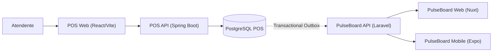

# PulseBoard POS

Ponto de venda (POS) que faz parte do ecossistema [PulseBoard](https://app.henriqueverri.dev). É um **sistema externo** ao PulseBoard: tem outro domínio, outro banco e outro ciclo de deploy, e só vai conhecer o PulseBoard pelo contrato público de ingestão (`POST /api/v1/ingest/*` com API Key). Nenhum código ou banco é compartilhado entre os dois repositórios.

> **Status: F9 — Autenticação.** O backend tem produtos, clientes e pedidos com ciclo de vida completo, API REST documentada no Swagger, erros em ProblemDetail, autenticação JWT com papéis ADMIN/CASHIER e testes com PostgreSQL real. Ainda **não existem** frontend, outbox nem integração com o PulseBoard; eles chegam nas próximas fases.

## Ecossistema (arquitetura alvo)



Fluxo planejado: a venda acontece no POS; o pedido pago grava um evento numa *transactional outbox* na mesma transação; um worker entrega a venda à API de ingestão do PulseBoard, que a transforma em analytics para o Web e o Mobile.

**O que existe hoje (F9):** apenas `POS API` + `PostgreSQL POS`. O restante do diagrama é arquitetura planejada.

## Stack

- Java 21, Spring Boot 3.5 (Web, Validation, Data JPA, Actuator, Security, OAuth2 Resource Server)
- PostgreSQL 16 e Flyway
- springdoc-openapi (Swagger UI)
- Maven (wrapper incluído)
- JUnit 5 e Testcontainers (PostgreSQL real nos testes, nunca H2)
- Spotless (google-java-format)
- Docker Compose (apenas o PostgreSQL)
- GitHub Actions

A API é um *resource server* JWT stateless (Spring Security + Nimbus, HS256), sem biblioteca JWT de terceiros. Detalhes na seção [Autenticação](#autenticação).

## Estrutura

```text
pulseboard-pos/
├── backend/                         API Spring Boot
│   ├── pom.xml, mvnw, mvnw.cmd, .mvn/
│   └── src/
│       ├── main/java/dev/henriqueverri/pos/   (package by feature)
│       │   ├── PosApplication.java
│       │   ├── shared/      ProblemDetail + códigos, Money (string JSON), PageResponse, Clock, OpenAPI
│       │   ├── catalog/     Product: entidade, repositório, serviço, controller, dto/
│       │   ├── customer/    Customer: idem
│       │   ├── order/       Order, OrderItem, OrderStatus, PaymentMethod: idem
│       │   └── security/    SecurityConfig, TokenService, AuthController, User, Role, UserSeeder
│       ├── main/resources/
│       │   ├── application.yml
│       │   └── db/migration/V1__baseline.sql … V5__users.sql
│       └── test/java/dev/henriqueverri/pos/   espelha os pacotes + support/
├── docker-compose.yml               PostgreSQL do POS (porta 5433)
├── .env.example
└── .github/workflows/ci.yml
```

## Pré-requisitos

- JDK 21
- Docker (para o PostgreSQL local e para os testes com Testcontainers)

O Maven não precisa estar instalado: use o `./mvnw` dentro de `backend/`.

## Como rodar

### 1. PostgreSQL

```bash
cp .env.example .env   # opcional: os defaults já funcionam
docker compose up -d
```

O PostgreSQL do POS escuta em **`localhost:5433`** (e não em 5432) para não colidir com o PostgreSQL do PulseBoard. Os dados ficam no volume `pos-db-data`.

### 2. API

```bash
cp .env.example .env              # se ainda não fez no passo 1
set -a; source .env; set +a       # a API lê as variáveis do ambiente (POS_JWT_SECRET é obrigatória)
cd backend
./mvnw spring-boot:run
```

A API sobe em `http://localhost:8080` e o Flyway aplica as migrations na inicialização. Sem `POS_JWT_SECRET` com pelo menos 32 bytes a aplicação **não sobe** (falha explícita no startup).

### 3. Health check

```bash
curl http://localhost:8080/actuator/health
# {"status":"UP"}
```

`/actuator/health` inclui a conexão com o banco: com o PostgreSQL fora do ar a resposta é `503` com `{"status":"DOWN"}`. É o único endpoint do Actuator exposto.

### 4. Swagger

- Swagger UI: `http://localhost:8080/swagger-ui/index.html`
- OpenAPI JSON: `http://localhost:8080/v3/api-docs`

Primeiro faça login em `POST /api/auth/login` (ex.: `caixa@pos.example` / `caixa-dev-password` do `.env.example`), copie o `access_token`, clique em **Authorize** e cole o token (o Swagger adiciona `Bearer`). Roteiro: criar cliente (`POST /api/customers`) → buscar produtos (`GET /api/products?q=PB-001`) → criar pedido (`POST /api/orders`) → pagar (`POST /api/orders/{id}/pay`) → estornar (`POST /api/orders/{id}/refund`). Um segundo pedido pode ser cancelado enquanto `PENDING`; qualquer transição fora da máquina de estados devolve `409`.

## Autenticação

- `POST /api/auth/login` com `{ "email", "password" }` devolve `{ access_token, token_type: "Bearer", expires_in: 28800, user: { id, name, email, role } }`. Credencial errada (e-mail inexistente ou senha incorreta) devolve o mesmo `401 invalid_credentials`.
- `GET /api/auth/me` devolve o usuário do token.
- Token **HS256** de **8 h** (um turno), assinado com `POS_JWT_SECRET` (≥ 32 bytes, validado no startup). Claims: `sub` (id), `email`, `role`, `iat`, `exp`. Sem refresh token: expirou, novo login.
- API **stateless**: sem sessão HTTP e sem cookies; o cliente envia `Authorization: Bearer <token>`.
- Sem cadastro: os usuários `ADMIN` e `CASHIER` são criados (ou sincronizados, se a senha/nome mudar) no startup a partir de `POS_ADMIN_*` e `POS_CASHIER_*`, com senha em BCrypt. Uma variável sem e-mail ou senha apenas pula aquele usuário (com aviso no log).

Matriz de permissões (definida num único lugar, o `SecurityFilterChain`):

| Rota | Público | CASHIER | ADMIN |
|---|---|---|---|
| `POST /api/auth/login`, `/actuator/health`, `/swagger-ui`, `/v3/api-docs` | sim | sim | sim |
| `GET /api/auth/me`, `GET /api/products/**` | — | sim | sim |
| `/api/customers/**` (listar, criar, editar) | — | sim | sim |
| `POST /api/orders`, `GET /api/orders/**`, `pay`, `cancel` | — | sim | sim |
| `POST /api/products`, `PUT /api/products/{id}` | — | **não** | sim |
| `POST /api/orders/{id}/refund` | — | **não** | sim |

Sem token, token malformado, expirado ou com assinatura inválida → `401 unauthorized` (com `WWW-Authenticate: Bearer`); papel insuficiente → `403 forbidden`. Ambos em ProblemDetail, no mesmo formato dos demais erros.

## Domínio e API

| Recurso | Rotas |
|---|---|
| Produtos | `GET /api/products?q&active&page&size`, `GET /api/products/{id}`, `POST /api/products`, `PUT /api/products/{id}` (`active` ativa/desativa) |
| Clientes | `GET /api/customers?q&page&size`, `GET /api/customers/{id}`, `POST /api/customers`, `PUT /api/customers/{id}` |
| Pedidos | `GET /api/orders?status&from&to&number&page&size`, `GET /api/orders/{id}`, `POST /api/orders`, `POST /api/orders/{id}/pay`, `POST /api/orders/{id}/cancel`, `POST /api/orders/{id}/refund` |

Regras principais:

- **Máquina de estados:** `PENDING → PAID`, `PENDING → CANCELED`, `PAID → REFUNDED`. Todo o resto é `409 invalid_order_transition`. `paid_at`, `canceled_at` e `refunded_at` são gravados em segundos inteiros (UTC).
- **Locking otimista:** `Order` tem `@Version`; duas alterações concorrentes do mesmo pedido resultam em `409 concurrent_modification` para a segunda.
- **Totais no servidor:** o pedido recebe só `{ customerId, items: [{ productId, quantity }] }`. Preço unitário, SKU e nome vêm do catálogo e ficam como *snapshot* no item; `line_total = unit_price × quantity` e `total = Σ line_total`. Valores enviados pelo cliente são ignorados. Não há desconto nem frete, por isso só existe `total` (sem `subtotal`).
- **Dinheiro:** `NUMERIC(12,2)` no banco, `BigDecimal` com duas casas no Java e **string** no JSON (`"409.70"`), nos dois sentidos: número JSON em campo monetário é rejeitado. Não há arredondamento: entradas com mais de duas casas são rejeitadas e as contas (preço × quantidade inteira, soma) são exatas.
- **Produtos:** SKU obrigatório (até 64) e único. Produto inativo não pode ser vendido (`422 product_inactive`). Sem estoque.
- **Clientes:** e-mail obrigatório, único sem diferenciar maiúsculas (armazenado em minúsculas); `document` é opcional e interno ao POS.
- **Pedidos:** cliente obrigatório, de 1 a 100 itens, quantidade de 1 a 10.000, cada produto uma única vez (`422 duplicate_order_item`). Número legível sequencial (`number`) além do `id` UUID. Moeda única configurada em `POS_CURRENCY`.
- **Paginação:** `page` (desde 0) e `size` (1–100) com envelope `{ content, page, size, totalElements, totalPages }`.

### Catálogo de demonstração

`V4__seed_catalog.sql` cria os 40 SKUs da organização de demo do PulseBoard (`PB-001-ESS` a `PB-020-PRO`), com nomes e preços copiados do `DemoDataSeeder` do PulseBoard. Os SKUs precisam existir nos dois sistemas para a futura integração aceitar a venda.

### Erros

Todos os erros seguem ProblemDetail (RFC 9457), com `Content-Type: application/problem+json`, a propriedade estável `code` e, em validação, `errors` por campo:

```json
{
  "type": "about:blank",
  "title": "Bad Request",
  "status": 400,
  "detail": "Os dados enviados são inválidos.",
  "instance": "/api/customers",
  "code": "validation_failed",
  "errors": { "email": ["deve ser um endereço de e-mail bem formado"] }
}
```

| Status | `code` |
|---|---|
| 400 | `validation_failed`, `malformed_request` |
| 401 | `unauthorized`, `invalid_credentials` |
| 403 | `forbidden` |
| 404 | `not_found` |
| 409 | `invalid_order_transition`, `concurrent_modification`, `duplicate_sku`, `duplicate_email` |
| 422 | `unknown_customer`, `unknown_product`, `product_inactive`, `duplicate_order_item`, `order_total_too_large` |
| 500 | `internal_error` (sem detalhes internos nem stack trace) |

## Configuração

A API lê as variáveis do ambiente; os defaults de `application.yml` apontam para o PostgreSQL do Compose. O Docker Compose lê o `.env` da raiz automaticamente.

| Variável | Padrão | Uso |
|---|---|---|
| `POS_DB_URL` | `jdbc:postgresql://localhost:5433/pulseboard_pos` | JDBC URL da API |
| `POS_DB_USER` | `pos` | usuário do banco (API e Compose) |
| `POS_DB_PASSWORD` | `pos` | senha do banco (API e Compose), só para desenvolvimento local |
| `POS_DB_NAME` | `pulseboard_pos` | nome do banco criado pelo Compose |
| `POS_DB_PORT` | `5433` | porta do PostgreSQL no host |
| `SERVER_PORT` | `8080` | porta HTTP da API |
| `POS_CURRENCY` | `BRL` | moeda dos pedidos |
| `POS_JWT_SECRET` | — (obrigatória, ≥ 32 bytes) | segredo HS256 dos tokens |
| `POS_ADMIN_EMAIL` / `POS_ADMIN_PASSWORD` / `POS_ADMIN_NAME` | — / — / `Administrador` | usuário ADMIN criado no startup |
| `POS_CASHIER_EMAIL` / `POS_CASHIER_PASSWORD` / `POS_CASHIER_NAME` | — / — / `Caixa` | usuário CASHIER criado no startup |

Nunca coloque credenciais reais no `.env.example` ou no repositório.

## Testes

```bash
cd backend
./mvnw verify
```

Os testes de integração usam **Testcontainers**: sobem um `postgres:16-alpine` descartável (o Docker precisa estar rodando; o Compose não é necessário), aplicam o Flyway do zero e nunca usam H2. O que cada suíte protege:

| Suíte | Cobre |
|---|---|
| `OrderStatusTest`, `OrderTest` | matriz completa de transições, totais, snapshots, timestamps em segundos |
| `MoneyTest` | escala, ausência de arredondamento silencioso, string no JSON, número JSON rejeitado |
| `OrderApiTest` | fluxo criar → pagar → estornar, cancelar, 409 em transições inválidas, 404, 422, validação, paginação e filtros, totais do cliente ignorados |
| `ProductApiTest`, `CustomerApiTest` | CRUD, unicidade de SKU/e-mail (409), validação, busca e paginação |
| `OrderOptimisticLockingTest` | duas transações concorrentes no mesmo pedido: a segunda falha por `@Version` |
| `RepositoryIntegrationTest` | seed dos 40 SKUs, constraints e índices únicos, sequência do número do pedido |
| `OpenApiDocsTest` | OpenAPI com as rotas reais, dinheiro como `string` e esquema Bearer |
| `AuthApiTest` | login (válido, inválido, indistinguível), claims e validade do token, `/auth/me`, 401 sem token / malformado / expirado / assinatura inválida, rotas públicas |
| `AuthorizationMatrixTest` | matriz ADMIN/CASHIER (403) e 401 em todas as rotas da API |
| `SecurityPropertiesTest`, `UserSeederTest` | startup falha com segredo fraco; seed idempotente com BCrypt |
| `PosApplicationIntegrationTest` | PostgreSQL 16, migrations aplicadas, `/actuator/health` `UP` |

Para rodar só os testes: `./mvnw test`.

## Formatação

```bash
cd backend
./mvnw spotless:check   # verifica (também roda no `verify` e na CI)
./mvnw spotless:apply   # formata
```

## Migrations

As migrations ficam em `backend/src/main/resources/db/migration`:

| Versão | Conteúdo |
|---|---|
| `V1__baseline.sql` | vazia (só comentários): inaugura o histórico do Flyway |
| `V2__catalog_customers.sql` | `products`, `customers` |
| `V3__orders.sql` | `orders` (com `version`), `order_items`, sequência `order_number_seq` |
| `V4__seed_catalog.sql` | catálogo de demonstração (40 SKUs) |
| `V5__users.sql` | `users` (e-mail único, hash BCrypt, papel `ADMIN`/`CASHIER`) |

## CI

`.github/workflows/ci.yml` roda o job `backend` em todo push na `main` e em pull requests: Java 21 (Temurin) com cache do Maven, e `./mvnw -B spotless:check verify`. Os testes com Testcontainers usam o Docker do runner do GitHub.
