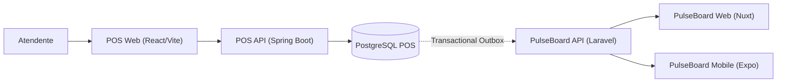

# PulseBoard POS

Ponto de venda (POS) que faz parte do ecossistema [PulseBoard](https://app.henriqueverri.dev). É um **sistema externo** ao PulseBoard: tem outro domínio, outro banco e outro ciclo de deploy, e só vai conhecer o PulseBoard pelo contrato público de ingestão (`POST /api/v1/ingest/*` com API Key). Nenhum código ou banco é compartilhado entre os dois repositórios.

> **Status: F7 — Foundation.** Este repositório tem, por enquanto, apenas o esqueleto técnico do backend: aplicação Spring Boot, PostgreSQL com Flyway, health check, testes de integração com Testcontainers, formatação e CI. Ainda **não existem** domínio (produtos, clientes, pedidos), autenticação, frontend, outbox nem integração com o PulseBoard; eles chegam nas próximas fases.

## Ecossistema (arquitetura alvo)



Fluxo planejado: a venda acontece no POS; o pedido pago grava um evento numa *transactional outbox* na mesma transação; um worker entrega a venda à API de ingestão do PulseBoard, que a transforma em analytics para o Web e o Mobile.

**O que existe hoje (F7):** apenas `POS API` + `PostgreSQL POS`. O restante do diagrama é arquitetura planejada.

## Stack

- Java 21, Spring Boot 3.5 (Web, Validation, Data JPA, Actuator, Security)
- PostgreSQL 16 e Flyway
- Maven (wrapper incluído)
- JUnit 5 e Testcontainers (PostgreSQL real nos testes, nunca H2)
- Spotless (google-java-format)
- Docker Compose (apenas o PostgreSQL)
- GitHub Actions

O Spring Security está presente, mas **provisoriamente aberto** (`permitAll` explícito em `SecurityConfig`): não há usuários, papéis nem tokens. A autenticação JWT é uma fase posterior.

## Estrutura

```text
pulseboard-pos/
├── backend/                         API Spring Boot
│   ├── pom.xml, mvnw, mvnw.cmd, .mvn/
│   └── src/
│       ├── main/java/dev/henriqueverri/pos/
│       │   ├── PosApplication.java
│       │   └── security/SecurityConfig.java
│       ├── main/resources/
│       │   ├── application.yml
│       │   └── db/migration/V1__baseline.sql
│       └── test/java/dev/henriqueverri/pos/
│           ├── PosApplicationIntegrationTest.java
│           └── support/TestcontainersConfiguration.java
├── docker-compose.yml               PostgreSQL do POS (porta 5433)
├── .env.example
└── .github/workflows/ci.yml
```

## Pré-requisitos

- JDK 21
- Docker (para o PostgreSQL local e para os testes com Testcontainers)

O Maven não precisa estar instalado: use o `./mvnw` dentro de `backend/`.

## Como rodar

### 1. PostgreSQL

```bash
cp .env.example .env   # opcional: os defaults já funcionam
docker compose up -d
```

O PostgreSQL do POS escuta em **`localhost:5433`** (e não em 5432) para não colidir com o PostgreSQL do PulseBoard. Os dados ficam no volume `pos-db-data`.

### 2. API

```bash
cd backend
./mvnw spring-boot:run
```

A API sobe em `http://localhost:8080` e o Flyway aplica as migrations na inicialização.

### 3. Health check

```bash
curl http://localhost:8080/actuator/health
# {"status":"UP"}
```

`/actuator/health` inclui a conexão com o banco: com o PostgreSQL fora do ar a resposta é `503` com `{"status":"DOWN"}`. É o único endpoint do Actuator exposto.

## Configuração

A API lê as variáveis do ambiente; os defaults de `application.yml` apontam para o PostgreSQL do Compose. O Docker Compose lê o `.env` da raiz automaticamente.

| Variável | Padrão | Uso |
|---|---|---|
| `POS_DB_URL` | `jdbc:postgresql://localhost:5433/pulseboard_pos` | JDBC URL da API |
| `POS_DB_USER` | `pos` | usuário do banco (API e Compose) |
| `POS_DB_PASSWORD` | `pos` | senha do banco (API e Compose), só para desenvolvimento local |
| `POS_DB_NAME` | `pulseboard_pos` | nome do banco criado pelo Compose |
| `POS_DB_PORT` | `5433` | porta do PostgreSQL no host |
| `SERVER_PORT` | `8080` | porta HTTP da API |

Nunca coloque credenciais reais no `.env.example` ou no repositório.

## Testes

```bash
cd backend
./mvnw verify
```

Os testes de integração usam **Testcontainers**: sobem um `postgres:16-alpine` descartável (o Docker precisa estar rodando; o Compose não é necessário), iniciam a aplicação completa, aplicam o Flyway do zero e verificam:

- conexão com o PostgreSQL real;
- migration `V1` aplicada com sucesso e nenhuma pendente;
- `/actuator/health` `UP`, incluindo o componente `db`.

Para rodar só os testes: `./mvnw test`.

## Formatação

```bash
cd backend
./mvnw spotless:check   # verifica (também roda no `verify` e na CI)
./mvnw spotless:apply   # formata
```

## Migrations

As migrations ficam em `backend/src/main/resources/db/migration`. A `V1__baseline.sql` é intencionalmente vazia (só comentários): inaugura o histórico do Flyway sem criar tabelas artificiais. As tabelas de domínio chegam em novas versões nas próximas fases.

## CI

`.github/workflows/ci.yml` roda o job `backend` em todo push na `main` e em pull requests: Java 21 (Temurin) com cache do Maven, e `./mvnw -B spotless:check verify`. Os testes com Testcontainers usam o Docker do runner do GitHub.
