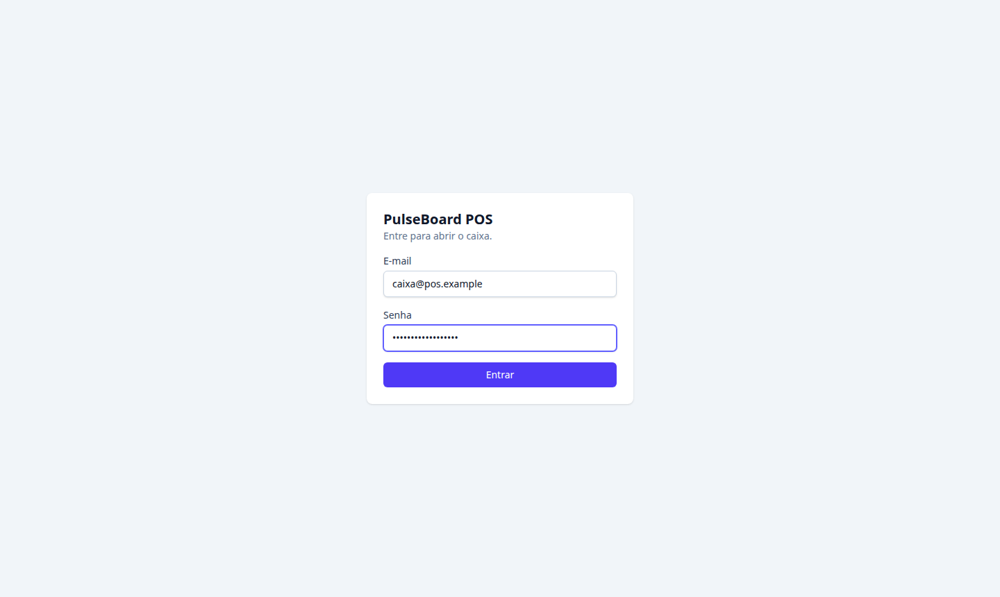
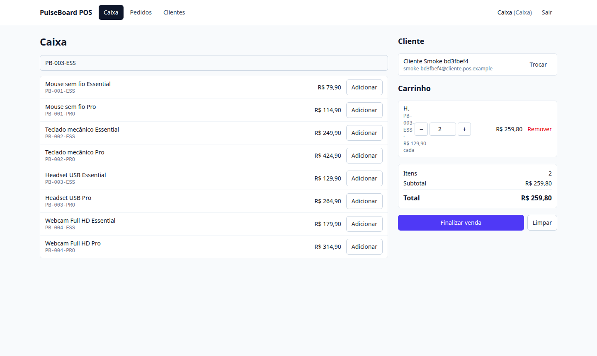
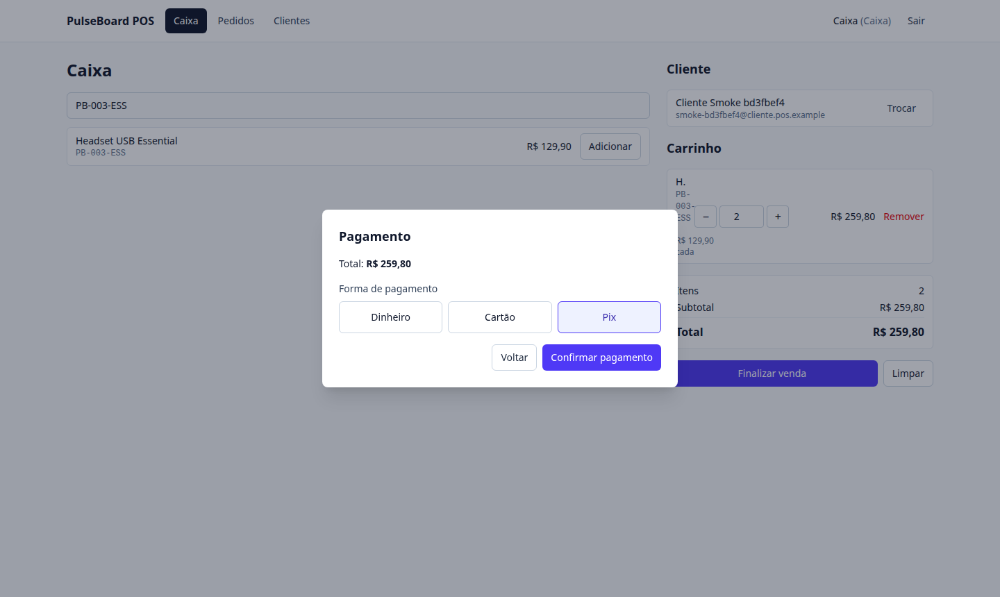
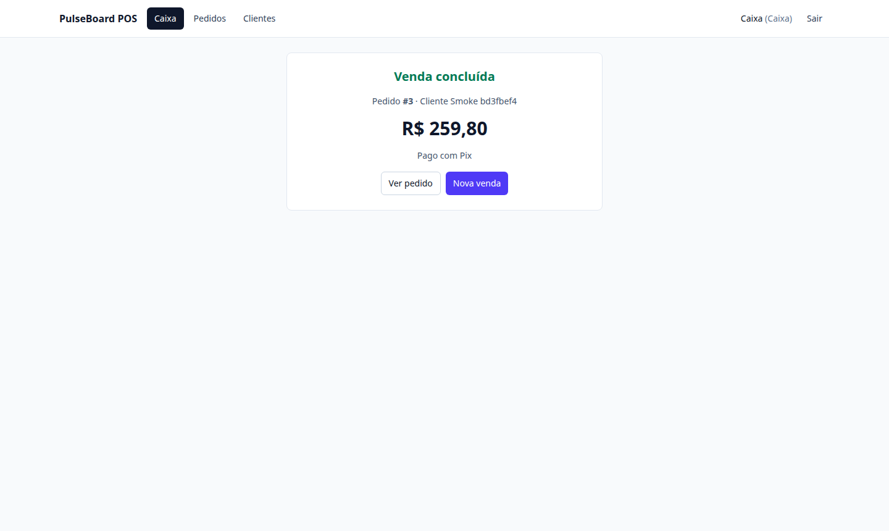
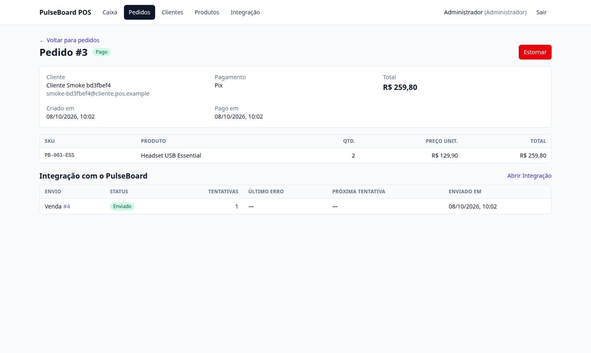
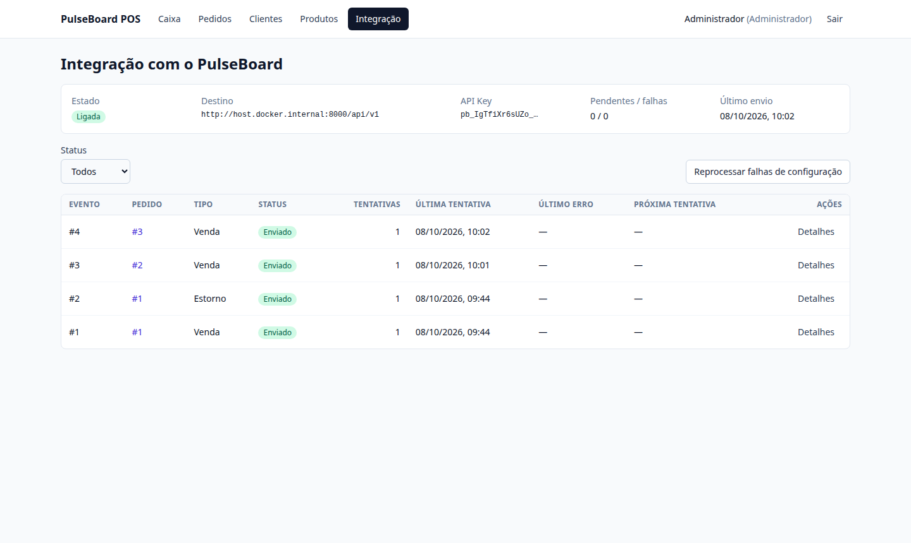
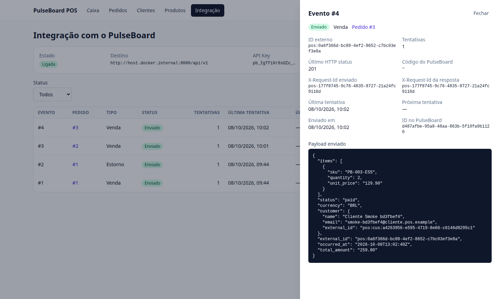
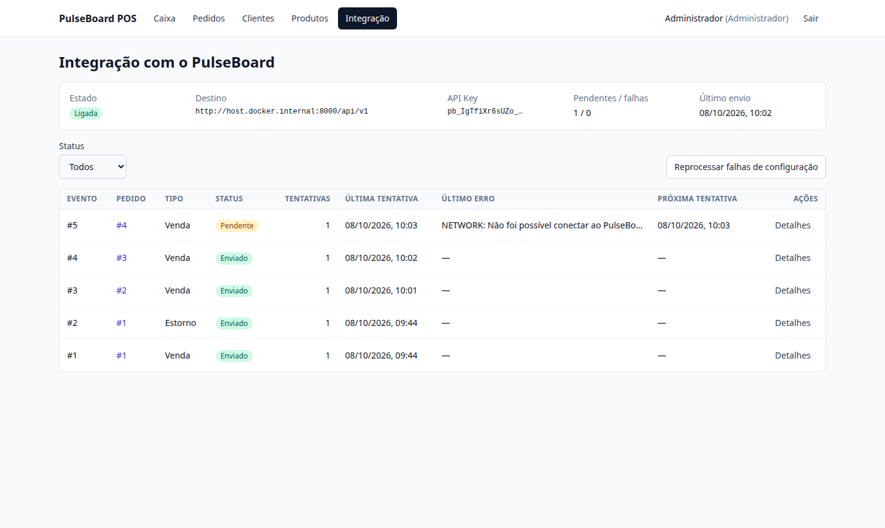

# Demo

Roteiro reproduzível da integração POS → PulseBoard e screenshots reais tiradas do ambiente Docker Compose (web → api → db) entregando a um PulseBoard local, em 2026-10-08. Nenhuma tela é mock.

> **TODO:** gravar um vídeo/GIF curto do roteiro abaixo (venda → Integração → PulseBoard Web → falha e retry → estorno). O ambiente usado para estas capturas não tinha ferramenta de gravação de vídeo; as screenshots cobrem os mesmos passos, exceto a tela do PulseBoard Web.

## Preparação

1. **PulseBoard local** (repositório `pulseboard`, sem nenhuma alteração):
   ```bash
   cd pulseboard && docker compose up -d                 # PostgreSQL do PulseBoard
   cd apps/api && php artisan migrate && php artisan pulseboard:demo
   php artisan serve --host=0.0.0.0 --port=8000          # 0.0.0.0: o container do POS alcança o host
   ```
   A organização de demo tem os 40 SKUs do catálogo do POS e moeda BRL.
2. **API Key**: no PulseBoard Web, entre como owner (`demo@example.com`) e crie uma chave em **Integração → API Keys**.
3. **POS**:
   ```bash
   cp .env.example .env
   # edite .env: PULSEBOARD_API_KEY=pb_...   (só no .env local, que o git ignora)
   docker compose up --build
   ```
   Abra `http://localhost:8088`.

## Roteiro

### 1. Login

`caixa@pos.example` / `caixa-dev-password` (CASHIER) para vender; `admin@pos.example` / `admin-dev-password` (ADMIN) para estornar e ver a Integração.



### 2. Venda no caixa

Buscar o cliente, buscar o produto por SKU, ajustar a quantidade. Os totais são prévia em centavos inteiros; o servidor recalcula.



### 3. Pagamento

Forma de pagamento simulada (Dinheiro, Cartão, Pix). Ao confirmar, o pedido vira `PAID` e o evento `ORDER_PAID` é gravado na outbox **na mesma transação**.





### 4. O evento aparece na integração

No detalhe do pedido (qualquer papel), a seção "Integração com o PulseBoard" mostra o envio: em segundos o status passa de Pendente a **Enviado**.



### 5. Entrega ao PulseBoard

Tela **Integração** (ADMIN): estado da integração, destino, prefixo da chave, pendentes/falhas, último envio e a lista de eventos.



O painel do evento mostra o payload exato enviado, o HTTP status, o `X-Request-Id` enviado e o recebido (`pos-<id do evento>` nos dois) e o ID da transação no PulseBoard.



### 6. Falha e retry

Com o PulseBoard parado, uma nova venda fica **Pendente** com o erro `NETWORK` e a próxima tentativa agendada (backoff exponencial com jitter). A venda no POS não é afetada.



Ao religar o PulseBoard, o worker entrega sozinho na tentativa seguinte (aqui, a 3ª), sem ação manual.


### 7. Pedido refletido no PulseBoard

No PulseBoard Web, **Transações** → buscar `pos:<uuid do pedido>`: a venda aparece com origem "Integração", itens, cliente `pos:cus:<uuid>` e a linha do tempo de status. Depois de **Estornar** no POS (ADMIN), a mesma transação passa a `refunded` com o histórico `paid → refunded`.

Sem screenshot desta etapa: o PulseBoard Web não estava em execução no ambiente da captura. A verificação foi feita pela API do PulseBoard, com a mesma chave:

```bash
curl -s "$PULSEBOARD_API_URL/ingest/transactions/pos:<uuid do pedido>" \
  -H "Authorization: Bearer $PULSEBOARD_API_KEY" -H "Accept: application/json"
# {"data":{"external_id":"pos:ed781c6c-…","status":"refunded","total_amount":"159.80",
#   "customer":{"external_id":"pos:cus:a4263956-…"},
#   "status_history":[{"to_status":"paid",…,"source":"ingest"},{"to_status":"refunded",…,"source":"ingest"}]}}
```

### 8. Rastreio ponta a ponta

```bash
docker compose logs api | grep 'pos-<id do evento>'     # tentativas do POS (JSON)
grep 'pos-<id do evento>' pulseboard/apps/api/storage/logs/laravel.log   # mesma requisição no PulseBoard
```

Exemplo real das linhas em [`integration.md`](integration.md#observabilidade).

## Outros cenários para mostrar

| Cenário | Como provocar | O que aparece |
|---|---|---|
| Chave inválida | `PULSEBOARD_API_KEY` com uma chave revogada + restart da API | evento `FAILED` / configuração, banner "Integração pausada", `state: PAUSED` no health; nenhuma nova requisição por 15 min |
| SKU inexistente | cadastrar no POS um produto com SKU que não existe no PulseBoard e vendê-lo | `FAILED` / rejeitado com `items.0.sku`; o estorno do mesmo pedido fica "bloqueado por #N" |
| Replay idempotente | difícil de provocar à mão (depende de derrubar a API entre o envio e a gravação do resultado); coberto pelos testes `aRedeliveryAfterALostResultIsAnIdempotentReplay` e `aTimeoutThenAReplayIsSentOnce` | o reenvio recebe `200` com `Idempotent-Replayed` e vira Enviado, sem venda duplicada |
| Reprocessar | botão **Reprocessar** em um evento `FAILED`, depois de corrigir a causa | o evento volta a Pendente e é entregue |
