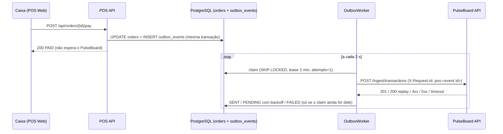
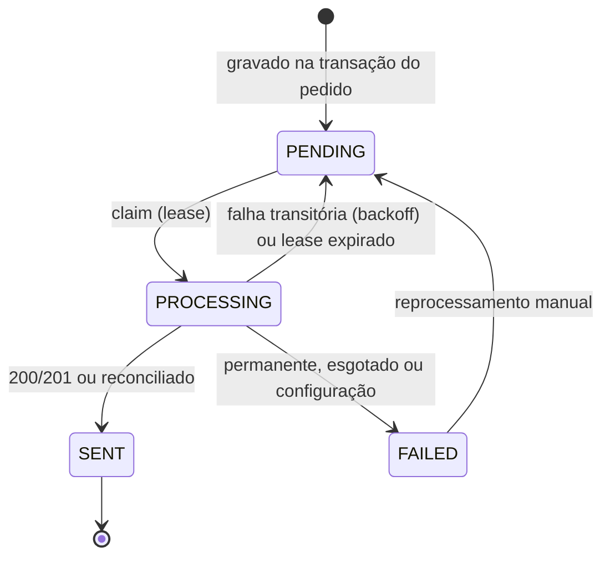

# Integração POS → PulseBoard

Como uma venda do POS chega ao PulseBoard: contrato, Transactional Outbox, worker, classificação das respostas, retry, idempotência, reconciliação, reprocessamento e observabilidade. Visão geral e quickstart no [README](../README.md); checklist de conformidade com o contrato em [`contract-checklist.md`](contract-checklist.md).

O POS usa **apenas** o contrato público de ingestão do PulseBoard (`docs/integration.md` do repositório `pulseboard`), autenticado por uma API Key da organização. Nada no PulseBoard foi criado ou alterado para o POS.

```text
OrderService.pay() / refund()
  └── @Transactional ─┬── UPDATE orders (status, paid_at / refunded_at)
                      └── INSERT outbox_events (ORDER_PAID / ORDER_REFUNDED, payload snapshot)
                                   │ commit
                                   ▼
                     OutboxWorker (@Scheduled, a cada 2 s)
                       1. claim   (transação curta: FOR UPDATE SKIP LOCKED + lease)
                       2. HTTP    (fora de transação)  ──►  PulseBoard /api/v1/ingest/*
                       3. record  (transação curta, condicionada ao claim: fencing por attempts)
```



## Eventos

| Mudança no pedido | Evento | Requisição |
|---|---|---|
| `PENDING → PAID` | `ORDER_PAID` | `POST /ingest/transactions` |
| `PAID → REFUNDED` | `ORDER_REFUNDED` | `POST /ingest/transactions/{external_id}/status-changes` |
| `PENDING → CANCELED` | — | nenhuma: um pedido nunca pago não é venda para o PulseBoard |

### Payload `ORDER_PAID`

```json
{
  "external_id": "pos:7b1e2c4a-9f0d-4c1e-8a55-0d6f3b2a9c10",
  "status": "paid",
  "occurred_at": "2026-10-06T21:14:05Z",
  "currency": "BRL",
  "customer": {
    "external_id": "pos:cus:3f6a0d2e-1b7c-4e90-a2d4-5c8e9f01b234",
    "name": "Ana Lima",
    "email": "ana.lima@cliente.pos.example"
  },
  "items": [
    { "sku": "PB-001-ESS", "quantity": 2, "unit_price": "79.90" },
    { "sku": "PB-002-ESS", "quantity": 1, "unit_price": "249.90" }
  ],
  "total_amount": "409.70"
}
```

### Payload `ORDER_REFUNDED`

`POST /ingest/transactions/pos:<uuid do pedido>/status-changes`

```json
{ "status": "refunded", "occurred_at": "2026-10-06T22:03:40Z" }
```

- **`external_id`**: `pos:<uuid do pedido>` (venda) e `pos:cus:<uuid do cliente>` (cliente). O prefixo identifica a origem e evita colisão com outros sistemas da mesma organização. O `:` é válido no segmento de path; o client usa URI template sem reescapar e há teste da URL final.
- **Dinheiro** sempre como string decimal com duas casas (`"79.90"`), nunca número JSON.
- **Datas** em UTC com `Z`, truncadas para segundos (`paid_at` / `refunded_at`).
- **Não saem do POS:** `document` do cliente, forma de pagamento e o número legível do pedido.
- O corpo é montado por `IngestPayloadFactory` **no momento do evento** e gravado como snapshot (`jsonb`) em `outbox_events.payload`. Todo retry reenvia exatamente esse corpo.

## Headers

| Header | Valor |
|---|---|
| `Authorization` | `Bearer ${PULSEBOARD_API_KEY}` (`pb_<prefixo de 12>_<segredo de 40>`) |
| `Content-Type` / `Accept` | `application/json` |
| `X-Request-Id` | `pos-<uuid do evento>` (40 caracteres, dentro da regra 8–64 `A-Za-z0-9._-` do PulseBoard), **o mesmo em todas as tentativas** do evento, inclusive na consulta de reconciliação |

`X-Organization-Id` **não** é enviado: a organização vem da chave. O `X-Request-Id` devolvido pelo PulseBoard é gravado em `last_request_id`.

**API Key.** Lida de `PULSEBOARD_API_KEY` (variável de ambiente; nunca em arquivo versionado). Ela só trafega no header `Authorization`. Não aparece em logs, respostas, mensagens de erro, `toString()` das propriedades nem no health: as telas e o `/actuator/health` mostram apenas o prefixo público (os 12 caracteres entre `pb_` e o segundo `_`), e só quando a chave está bem formada.

## Worker, claim e lease

A cada `POS_OUTBOX_POLL_INTERVAL` (padrão 2 s) o `OutboxWorker`:

1. **Claim** numa transação curta (`OutboxStore.CLAIM`): `UPDATE … WHERE id IN (SELECT … ORDER BY sequence LIMIT 20 FOR UPDATE SKIP LOCKED) RETURNING …`. São elegíveis eventos `PENDING` com `next_attempt_at` vencido e eventos `PROCESSING` com lease expirado. O claim marca `PROCESSING`, `locked_until = now + 2 min` e `attempts = attempts + 1`.
2. **Envio HTTP fora de qualquer transação**: a chamada não segura conexão de banco nem lock de linha. Timeouts de 10 s (conexão) e 30 s (resposta).
3. **Registro** do resultado numa segunda transação curta, condicionada a `id = ? AND status = 'PROCESSING' AND attempts = ?`.

- **`FOR UPDATE SKIP LOCKED`**: duas instâncias (ou duas execuções sobrepostas) nunca reivindicam o mesmo evento. Não há ShedLock nem broker.
- **Lease (2 min)**: maior que conexão + leitura. Se o processo morre depois do claim, o evento volta a ser elegível quando o lease expira. Se morreu **depois** de o PulseBoard gravar, o reenvio recebe `200` replay e vira `SENT`.
- **Fencing por `attempts`**: `attempts` já conta a tentativa atual e funciona como token. Um worker atrasado, cujo lease expirou e foi re-reivindicado, não consegue gravar o resultado: o `UPDATE` não encontra a linha e o resultado é descartado (com log `outcome=discarded`).
- **Ordenação por pedido**: o claim só pega um evento se nenhum evento anterior do mesmo pedido (menor `sequence`) estiver fora de `SENT` (`NOT EXISTS`). O estorno nunca chega antes da venda. Enquanto a venda está falhando, o estorno aparece na UI como "bloqueado por #N", e o worker registra `outcome=blocking` com `blocked_events` quando uma falha definitiva segura eventos posteriores. Pedidos diferentes não se bloqueiam.

## Estados



`FAILED` sempre tem `failure_kind`: `PERMANENT`, `EXHAUSTED` ou `CONFIGURATION`.

## Classificação das respostas

Implementada em `IngestResponseClassifier`, seguindo a tabela de erros do contrato do PulseBoard.

| Resposta | Classe | O que acontece |
|---|---|---|
| `201 Created` | sucesso | `SENT`, `processed_at`, `remote_id` (`data.id`) |
| `200` + `Idempotent-Replayed: true` | sucesso | `SENT` (replay idempotente: a venda já existia) |
| `429 rate_limited` | transitório | `PENDING`, `next_attempt_at = now + Retry-After` (segundos ou data HTTP; 60 s se ausente) |
| `5xx` | transitório | `PENDING` com backoff, `last_error_code = HTTP_5XX` |
| timeout | transitório | `PENDING` com backoff, `TIMEOUT` (resultado desconhecido: o replay resolve) |
| falha de rede (conexão recusada, DNS, reset) | transitório | `PENDING` com backoff, `NETWORK` |
| `401 invalid_api_key` | configuração | `FAILED` / `CONFIGURATION` e **pausa** da integração (ver abaixo) |
| `409 invalid_transition` num estorno | reconciliação | `GET /ingest/transactions/{external_id}` (ver abaixo) |
| `409 customer_email_conflict` | permanente | `FAILED` / `PERMANENT`, com a instrução de vincular o cliente pelo ID externo no PulseBoard e reprocessar |
| `409 transaction_conflict` | permanente | `FAILED` / `PERMANENT`: payload divergente para o mesmo `external_id` (bug ou ID repetido) |
| `422` (`validation_failed`, `currency_mismatch`, `total_mismatch`) | permanente | `FAILED` / `PERMANENT`, com `code`, `message` e erros por campo (ex.: `items.0.sku`) |
| `404`, `413` e qualquer outro `4xx` | permanente | `FAILED` / `PERMANENT` (`code` do corpo, ou `HTTP_<status>`) |

Mensagens de erro gravadas em `last_error` ficam limitadas a 500 caracteres e nunca contêm headers da requisição.

## Retry e backoff

- Atraso depois da tentativa *n* (contada desde o último reprocessamento manual): `min(15 min, 10 s × 2^(n−1))`, multiplicado por um *jitter* aleatório em `[0,5; 1,0]`. Com `Retry-After` (429), vale o que o servidor pediu.
- Sequência nominal: 10 s, 20 s, 40 s, 80 s, 160 s, 320 s, 640 s, 15 min, 15 min → `FAILED` / `EXHAUSTED` na 10ª tentativa (`POS_OUTBOX_MAX_ATTEMPTS`), cerca de 1 h no pior caso.
- `next_attempt_at` fica no banco: sobrevive a restart.
- **Sem retry em processo** (Resilience4j, `@Retryable`): a outbox já é o mecanismo de retry, persistente e visível. Duas camadas dificultariam o raciocínio sobre tentativas.
- Cobre o cold start do PulseBoard em produção (Render): as primeiras tentativas podem dar timeout; uma seguinte entrega.

## 401: pausa da integração

1. O evento vai para `FAILED` / `CONFIGURATION` (`last_error_code = invalid_api_key`).
2. `IntegrationPause` pausa **a integração inteira** por 15 minutos (flag em memória): com a chave inválida, todos os eventos falhariam pelo mesmo motivo. O restante do lote é devolvido à fila sem gastar tentativa.
3. A tela de Integração mostra o banner; o health mostra `state: PAUSED`.
4. Depois do cooldown, o worker volta a reivindicar só eventos `PENDING`. Se a chave continuar inválida, o próximo 401 pausa de novo: **no máximo uma requisição a cada 15 min, nunca um loop**.
5. Depois de corrigir a chave (variável de ambiente + restart), **Reprocessar falhas de configuração** (`POST /api/integration/events/retry-configuration-failures`) devolve os `FAILED` / `CONFIGURATION` para `PENDING` e encerra a pausa.

A pausa é por instância (em memória): um restart a encerra, o que é coerente com "trocar a chave exige restart".

## Idempotência (at-least-once)

A entrega é **at-least-once**: um evento pode ser enviado mais de uma vez (timeout com a venda já gravada, worker que morreu depois do envio, lease expirado). Não é *exactly-once*. O que impede duplicidade é a idempotência do PulseBoard:

- A chave de idempotência é o `external_id` (restrição única por organização no PulseBoard).
- O PulseBoard compara um *fingerprint* do conteúdo (instante, moeda, status inicial, cliente e itens). Como o payload é um snapshot imutável, **todo reenvio é idêntico** e recebe `200` com `Idempotent-Replayed: true`, tratado como sucesso.
- Qualquer divergência vira `409 transaction_conflict`, tratado como falha permanente (sinal de bug, nunca uma segunda venda).
- No estorno, reenviar uma mudança de status já aplicada recebe `200` replay.

Testes que provam isso: `OutboxDeliveryTest.aRedeliveryAfterALostResultIsAnIdempotentReplay` e `aTimeoutThenAReplayIsSentOnce` (WireMock).

## Reconciliação (`409 invalid_transition`)

Um estorno pode receber `409 invalid_transition` quando o primeiro envio foi gravado mas a resposta se perdeu. O worker consulta `GET /ingest/transactions/{external_id}`, com o mesmo `X-Request-Id`:

| Estado remoto | Resultado |
|---|---|
| `refunded` | `SENT` (o estorno já estava aplicado) |
| outro status | `FAILED` / `PERMANENT` com o status remoto na mensagem |
| a consulta falhou de forma transitória | `PENDING` com backoff |
| a consulta deu 401 / 404 | `FAILED` (configuração / permanente) |

## Reprocessamento manual (ADMIN)

- `POST /api/integration/events/{id}/retry`: `FAILED → PENDING` para envio imediato. `attempts` é mantido como histórico; o limite e o backoff recomeçam a contar a partir daqui (`attempts_at_retry`). Evento que não está `FAILED` → `409 integration_event_not_failed`.
- `POST /api/integration/events/retry-configuration-failures`: em lote, só `CONFIGURATION`, e encerra a pausa.
- Reprocessar um `transaction_conflict` sem mudar nada falha de novo, de propósito: o payload é imutável.

## Integração desligada

Com `PULSEBOARD_INTEGRATION_ENABLED=false` ou `PULSEBOARD_API_KEY` vazia, o POS sobe e vende normalmente: os eventos são gravados como `PENDING` e o worker não reivindica nada. Ligar depois entrega tudo o que acumulou, na ordem.

## Observabilidade

Objetivo: a partir de um `external_id` ou de um `request_id`, reconstruir a história de uma venda nos logs do POS e achar a linha correspondente no PulseBoard. Sem OpenTelemetry, Prometheus ou Grafana: logs estruturados, um request id e um health indicator local.

### Logs JSON

O console usa o formato estruturado nativo do Spring Boot 3.5 (`logging.structured.format.console`, layout Logstash por padrão; `POS_LOG_FORMAT=ecs`/`gelf` troca o layout, `POS_LOG_FORMAT=` vazio volta ao texto simples). Cada linha traz `@timestamp`, `level`, `logger_name`, `message`, o MDC e os campos chave-valor do evento.

| Campo | Onde |
|---|---|
| `request_id` | MDC. Numa requisição HTTP: o `X-Request-Id` recebido ou gerado. No worker: `pos-<event id>` |
| `event_id` | MDC do worker; campo do log `enqueued` |
| `order_id`, `external_id`, `event_type`, `attempt` | logs do worker |
| `outcome` | `enqueued`, `claimed`, `reconciling`, `reconciled`, `sent`, `retry_scheduled`, `failed`, `blocking`, `released`, `discarded`, `error`, `integration_paused`, `integration_resumed`, `manual_retry` |
| `http_status`, `error_code`, `failure_kind`, `next_attempt_at`, `replayed`, `recorded` | resultado classificado e se foi persistido (`recorded=false` = claim perdido) |
| `target`, `operation`, `duration_ms`, `response_request_id`, `error_type` | uma linha por chamada do `PulseBoardClient` (`create_transaction`, `change_status`, `get_transaction`) |

Uma tentativa real, capturada no ambiente Docker (campos de infraestrutura omitidos):

```json
{"message":"Outbox event enqueued","request_id":"smoke-pay-bd3fbef4","event_id":"8bf457ee-…","order_id":"ed781c6c-…","external_id":"pos:ed781c6c-…","event_type":"ORDER_PAID","outcome":"enqueued"}
{"message":"Outbox event claimed; delivering to PulseBoard","request_id":"pos-8bf457ee-…","event_id":"8bf457ee-…","order_id":"ed781c6c-…","external_id":"pos:ed781c6c-…","event_type":"ORDER_PAID","attempt":1,"outcome":"claimed"}
{"message":"PulseBoard request completed","request_id":"pos-8bf457ee-…","event_id":"8bf457ee-…","target":"pulseboard","operation":"create_transaction","http_status":201,"replayed":false,"duration_ms":234,"response_request_id":"pos-8bf457ee-…"}
{"message":"Outbox event sent to PulseBoard","request_id":"pos-8bf457ee-…","event_id":"8bf457ee-…","order_id":"ed781c6c-…","external_id":"pos:ed781c6c-…","event_type":"ORDER_PAID","attempt":1,"outcome":"sent","http_status":201,"replayed":false,"recorded":true}
```

E a linha do PulseBoard para a mesma requisição (`storage/logs` do PulseBoard local):

```text
local.INFO: Transaction ingestion completed. {"request_id":"pos-8bf457ee-…","event":"ingest.transaction","outcome":"created", … ,"external_id":"pos:ed781c6c-…"}
```

A linha `enqueued` liga as duas pontas: ela é escrita dentro da requisição HTTP de pagamento (logo carrega o `request_id` dessa requisição) e informa o `event_id`, cujo envio usa `request_id = pos-<event_id>`.

**O que nunca é logado:** API Key, header `Authorization`, JWT, senhas, payloads, nome/e-mail do cliente e a mensagem de erro do PulseBoard (que pode citar dados do cliente; só o `code` vai para o log). As exceções de rede são registradas pelo tipo (`error_type`), sem mensagem, porque a mensagem pode conter a URL. Um teste (`OutboxObservabilityTest`) captura todos os eventos de log de uma sequência com `401` e sucesso e verifica que a chave e o segredo não aparecem em mensagem, MDC, campos ou stack trace.

**Volume:** um ciclo do worker sem trabalho não escreve nada. A integração pausada escreve só em `DEBUG`.

### Request ID nas requisições HTTP

`RequestIdFilter` (antes do Spring Security, então `401`/`403` também têm o header):

- reutiliza o `X-Request-Id` recebido se ele seguir a mesma regra do PulseBoard (8–64 caracteres `A-Za-z0-9._-`); senão gera um UUID (um valor malformado nunca é ecoado, para não injetar nada nos logs);
- coloca o valor no MDC como `request_id` durante a requisição e o devolve no header `X-Request-Id`;
- limpa o MDC ao final, inclusive quando a requisição falha.

O Nginx do container web repassa o header recebido do navegador sem alterá-lo.

### Health da integração

`/actuator/health` (único endpoint do Actuator exposto) tem o componente `pulseBoard` (`PulseBoardHealthIndicator`). Ele **não chama o PulseBoard**: reflete só o estado local, para que o health check não dependa nem gere carga num sistema externo.

| `state` | Quando |
|---|---|
| `DISABLED` | `PULSEBOARD_INTEGRATION_ENABLED=false` |
| `NOT_CONFIGURED` | ligada, mas sem `PULSEBOARD_API_KEY` |
| `INVALID_KEY` | a chave não tem o formato `pb_<prefixo>_<segredo>` (o PulseBoard vai responder 401) |
| `PAUSED` | um 401 pausou a integração (`pausedUntil`) |
| `ACTIVE` | entregando |

Detalhes: `state`, `enabled`, `apiUrl` (sem credenciais embutidas), `keyPrefix` (só com chave bem formada), `pausedUntil`, `pending` e `failed`. O componente é sempre `UP`: o POS continua vendendo com a integração desligada, pausada ou mal configurada (os eventos esperam na outbox), então nenhum desses estados torna a aplicação indisponível nem derruba o healthcheck do Docker.

Visibilidade: chamadas anônimas (healthcheck do Docker, balanceador) veem só `{"status":"UP"}`; com um token **ADMIN** a resposta inclui os componentes (`management.endpoint.health.show-details: when-authorized`, `roles: ADMIN`).

```bash
TOKEN=$(curl -s -X POST localhost:8080/api/auth/login -H 'Content-Type: application/json' \
  -d '{"email":"admin@pos.example","password":"admin-dev-password"}' | jq -r .access_token)
curl -s -H "Authorization: Bearer $TOKEN" localhost:8080/actuator/health | jq .components.pulseBoard
# {"status":"UP","details":{"state":"ACTIVE","enabled":true,"apiUrl":"http://host.docker.internal:8000/api/v1","keyPrefix":"<12 chars>","pending":0,"failed":0}}
```

## Troubleshooting

| Sintoma | Causa provável | O que fazer |
|---|---|---|
| Evento `FAILED` / `PERMANENT` com `items.0.sku` | SKU do POS inexistente no catálogo da organização | Cadastrar o SKU no PulseBoard (a organização de demo já tem os 40) e reprocessar |
| `409 customer_email_conflict` | o e-mail já pertence a outro cliente no PulseBoard | Preencher o "ID externo" desse cliente no PulseBoard com `pos:cus:<uuid>` e reprocessar |
| `422 currency_mismatch` | `POS_CURRENCY` diferente da moeda da organização | Ajustar `POS_CURRENCY` (pedidos novos); eventos antigos mantêm o snapshot |
| Banner "Integração pausada" / `state: PAUSED` | chave inválida, revogada ou expirada | Nova chave em `PULSEBOARD_API_KEY`, restart, **Reprocessar falhas de configuração** |
| Eventos `PENDING` com `NETWORK` no Docker | PulseBoard local escutando só em `127.0.0.1` | Subir com `php artisan serve --host=0.0.0.0 --port=8000` |
| Eventos `PENDING` sem tentativa | integração desligada ou sem chave (`state: DISABLED` / `NOT_CONFIGURED`) | Definir a chave e reiniciar a API |
